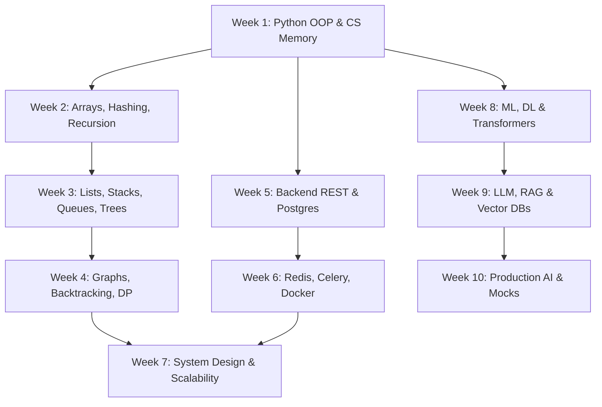

# 🚀 THE ULTIMATE 10-WEEK AI SOFTWARE ENGINEER PREPARATION SYSTEM

> **Designed For:** 22-Year-Old Engineering Student (Delhi, India)  
> **Availability:** 5–6 Hours Daily (~35–40 Hours/Week) | Timezone: IST (UTC+5:30)  
> **Target Companies:** Google, Meta, OpenAI, Anthropic, Stripe, Databricks, NVIDIA, and Top AI Startups  
> **Primary Stack:** Python, PostgreSQL, Redis, Celery, Docker, FastAPI, LangGraph, ChromaDB, React  

---

## 📌 MASTER TIMELINE & SCHEDULE

This schedule is optimized for your college calendar. It splits your 5–6 hours into a high-productivity early morning slot (before college) and focused evening slots (after college).

```
05:30 AM – 07:30 AM (2 Hours) → Morning Study: Concept Deep Dives, Docs & Resources
07:30 PM – 09:30 PM (2 Hours) → Afternoon Lab: Hands-on Code & LeetCode Problem Solving
09:30 PM – 10:30 PM (1 Hour)  → Evening Wrap-up: Notes Writing, Debugging, and Mistake Logs
```

---

## 🗓️ WEEK-BY-WEEK CONNECTION MAP



---

## 📅 SPACED REPETITION MASTER SCHEDULE

Use this tracker to ensure you review core concepts at increasing intervals to move them from short-term memory to permanent mastery.

| Topic / Pattern | Week Learned | Review 1 (Day +3) | Review 2 (Day +7) | Review 3 (Day +14) | Review 4 (Day +30) | Mastered |
| :--- | :--- | :--- | :--- | :--- | :--- | :--- |
| Python OOP & GIL | Week 1 | W1D4 | W2D1 | W3D1 | W5D1 | [ ] |
| CS Memory Stack/Heap | Week 1 | W1D6 | W2D2 | W3D2 | W5D2 | [ ] |
| Two Pointers & Sliding Window | Week 2 | W2D5 | W3D1 | W4D1 | W6D1 | [ ] |
| Recursion Stack Tracking | Week 2 | W2D7 | W3D3 | W4D3 | W6D3 | [ ] |
| Monotonic Stacks & Queues | Week 3 | W3D5 | W4D1 | W5D1 | W7D1 | [ ] |
| Tree DFS / BFS Traversals | Week 3 | W3D7 | W4D3 | W5D3 | W7D3 | [ ] |
| Backtracking Decision Trees | Week 4 | W4D6 | W5D1 | W6D1 | W8D1 | [ ] |
| Dynamic Programming (1D & 2D) | Week 4 | W4D7 | W5D3 | W6D3 | W8D3 | [ ] |
| FastAPI Routing & Middleware | Week 5 | W5D5 | W6D1 | W7D1 | W9D1 | [ ] |
| SQL Queries (Joins, CTEs) | Week 5 | W5D7 | W6D3 | W7D3 | W9D3 | [ ] |
| Redis Rate Limiting & Caching | Week 6 | W6D4 | W7D1 | W8D1 | W10D1 | [ ] |
| Celery Background Queues | Week 6 | W6D6 | W7D3 | W8D3 | W10D3 | [ ] |
| System Design Case Studies | Week 7 | W7D5 | W8D1 | W9D1 | W10D5 | [ ] |
| Transformer Attention Math | Week 8 | W8D5 | W9D1 | W10D1 | Post-W10 | [ ] |
| Vector Embeddings & RAG | Week 9 | W9D4 | W10D1 | W10D5 | Post-W10 | [ ] |
| Agentic LangGraph Workflows | Week 9 | W9D7 | W10D3 | W10D6 | Post-W10 | [ ] |

---

# WEEK 1: Python Mastery + CS Fundamentals

### SECTION A — WEEK OVERVIEW
- **Theme of the week**: Build clean, production-ready OOP structures in Python while mastering how code translates to threads, processes, and CPU memory boundaries.
- **Why this week matters**: To build scalable backends or fine-tune neural nets, you must understand Python's execution limitations (like the GIL) and memory layouts (Stack vs Heap). 
- **Outcomes**: You will be able to write thread-safe Python scripts, trace pointer addresses, analyze memory maps, and implement custom dynamic structures.
- **Prerequisites**: Basic Python syntax.
- **Estimated hours**: 35 hours (6 Days * 5 Hours + 5 Hours Revision).
- **Mindset**: You are not just writing code; you are managing hardware resources. Don't look at variables as text; see them as addresses in RAM.

### SECTION B — DAILY PLAN
- **DAY 1 — Python Scope, Closures & Reference Memory Model**
  - **Morning**: Scoping (`global`, `nonlocal`), Closures, and how Python handles references vs values. Official Doc: [Python Execution Model](https://docs.python.org/3/reference/executionmodel.html).
  - **Afternoon**: Write closure-based caching factories and inspect reference counts with `sys.getrefcount()`.
  - **Evening**: Record notes on Python variable binding behaviors.
  - **Daily Objective**: Map variable names to memory addresses.
  - **Daily Deliverable**: Single file with closure decorator that tracks internal memory usage.
- **DAY 2 — Dynamic Arrays, comprehensions & built-ins**
  - **Morning**: Memory mechanics of static vs dynamic arrays. Read [Fluent Python Chapter 2](https://www.oreilly.com/library/view/fluent-python-2nd/9781492056348/).
  - **Afternoon**: Build a dynamic array class using Python `ctypes` that automatically doubles size when full.
  - **Evening**: Solve LeetCode array initialization exercises.
  - **Daily Objective**: Implement resizing cost complexity analysis.
  - **Daily Deliverable**: Python file `custom_dynamic_array.py`.
- **DAY 3 — OOP: Inheritance, Dunder Methods & GIL**
  - **Morning**: Deep dive into python classes, method resolution order (MRO), and the Global Interpreter Lock (GIL). Blog: [Gevent and the GIL](https://realpython.com/python-gil/).
  - **Afternoon**: Build a thread pool counter and observe CPU bottlenecks due to the GIL.
  - **Evening**: Write a comparison table of Python multi-threading vs multi-processing.
  - **Daily Objective**: Write multi-threaded scripts blocked by the GIL.
  - **Daily Deliverable**: GIL performance test suite.
- **DAY 4 — CS Fundamentals: Processes & Threads**
  - **Morning**: Processes vs threads, context switching overhead, and thread scheduling. Read [OSTEP Chapters 4 & 5](https://ostep.org).
  - **Afternoon**: Write a Python script that forks processes using `os.fork()` (or uses `multiprocessing` on Windows) to benchmark context switches.
  - **Evening**: Read about CPU affinity and context switching penalties.
  - **Daily Objective**: Quantify process-level isolation vs thread-level sharing.
  - **Daily Deliverable**: Benchmarking report comparing thread and process launch times.
- **DAY 5 — Stack vs Heap & Memory Paging**
  - **Morning**: RAM layout: Stack frames vs Heap allocations, Virtual memory pages, and page faults. Read [OSTEP Chapters 13 & 15](https://ostep.org).
  - **Afternoon**: Draw stack/heap layouts for complex recursive functions using python debugger `pdb`.
  - **Evening**: Write a summary of virtual memory addresses translation.
  - **Daily Objective**: Differentiate execution stack memory from dynamic heap objects.
  - **Daily Deliverable**: Diagram of recursive call stack memory states.
- **DAY 6 — Git Internals, Linux Shells & Terminal Command Mastery**
  - **Morning**: Git under-the-hood: blob objects, trees, commits, and refs. CLI directory exploration. Document: [Git Internals](https://git-scm.com/book/en/v2/Git-Internals-Git-Objects).
  - **Afternoon**: Manually explore `.git/objects` after committing to find the exact SHA-1 hashes of file content.
  - **Evening**: Write custom shell shortcuts and configurations in `.bashrc`/`.zshrc`.
  - **Daily Objective**: Manage code versioning without using Git CLI helper commands.
  - **Daily Deliverable**: Script reproducing a commit using manual Git object writing.
- **DAY 7 — Revision & CLI Project Integration**
  - Revise GIL, Stack vs Heap, and MRO.
  - Consolidate week's code and mistake logs.
  - Complete and push **Personal Finance Tracker** CLI app.

### SECTION C — CONCEPTS DEEP DIVE
- **CONCEPT: Stack vs Heap Memory**
  - *Why it exists*: The CPU needs a fast, structured space for execution variables (Stack), but also requires a flexible, long-lived storage area for large or variable-sized objects (Heap).
  - *Mental model*: The Stack is a pile of trays in a cafeteria—last one placed is the first one used. The Heap is a messy storage room where you have to look up the catalog map (pointer) to find items.
  - *Internal step-by-step*: 
    1. A function `foo()` is called. The CPU moves the Stack Pointer (SP) down to allocate a stack frame.
    2. Local primitive variables are loaded onto the stack frame.
    3. If an object (like a dict) is created, Python allocates memory on the Heap, and saves the Heap memory address on the Stack frame.
    4. When `foo()` returns, the SP moves back up. The stack frame variables are immediately invalidated. The Heap object remains until garbage collected.
  - *Misconceptions*: "Variables in Python are stored on the Stack." (False: In Python, *everything* is an object on the heap; the Stack only stores references to those heap objects).
  - *Interviews*: "Explain stack overflow." or "Compare stack vs heap access speeds."
  - *Code template*:
    ```python
    import sys
    x = 1000  # References an int object on the Heap
    print(hex(id(x)))  # prints the raw Heap address
    ```
  - *Connection*: Weekly mini project uses files, which require heap descriptors in OS.

### SECTION D — BEST RESOURCES
| Name | Link | Why Recommended | Difficulty | Time | Free/Paid | What to Skip |
| :--- | :--- | :--- | :--- | :--- | :--- | :--- |
| Python Execution Model | [docs.python.org](https://docs.python.org/3/reference/executionmodel.html) | Precise details on naming scopes. | Intermediate | 1.5h | Free | Section on Execution Frame objects. |
| OSTEP (Memory Layouts) | [ostep.org](https://ostep.org) | Unmatched clarity on Virtual Memory and Processes. | Intermediate | 6h | Free | Chapters on scheduling heuristics. |
| Fluent Python | [oreilly.com](https://www.oreilly.com) | Python object references and internals. | Advanced | 4h | Paid | Chapter 3-4 details on unicode encoding. |
| Git Internals | [git-scm.com](https://git-scm.com/book/en/v2/Git-Internals-Git-Objects) | Essential for understand tree hashes. | Intermediate | 2h | Free | Packfiles details. |

### SECTION E — HANDS-ON LABS & PRACTICE
- **LAB 1: Python GIL Bottleneck Visualizer**
  - *Objective*: Measure CPU utilization and execution delay under CPU-bound tasks in multi-threading vs multi-processing.
  - *Difficulty*: Medium | *Time*: 45 minutes
  - *Build Spec*: Write a function `compute_heavy_math(n)` that calculates factors. Run it concurrently using 4 threads, then using 4 processes. Record time differences.
  - *Test cases*: 
    1. Single thread run time.
    2. Multi-threaded run time (should be >= single thread time due to lock overhead).
    3. Multi-processed run time (should approach 1/4 of single thread time on multi-core).
    4. Memory footprint of process vs thread approach.
    5. Resource lock acquisition log check.
  - *Mistakes*: Expecting Python threads to speed up numerical operations on a multi-core CPU.
  - *Challenge*: Release the GIL in multi-threading using a C-extension or `numpy`.

### SECTION F — VISUALIZATION RESOURCES
- **TOPIC: Call Stack Execution**
  - *Best Animation*: [Python Tutor](https://pythontutor.com) - Paste recursive code and watch stack frames push and pop.
  - *Simulator*: [VisuAlgo Array Simulator](https://visualgo.net/en/array) - Watch dynamic array expansions and copies.
  - *Visual Blog*: [ByteByteGo: Process vs Thread](https://blog.bytebytego.com) - High-quality animated infographic.
  - *Draw-it-yourself*: Draw three boxes representing stack frames of `fact(3) -> fact(2) -> fact(1)`. Draw arrows showing return value bubble-up.

### SECTION G — NOTES SYSTEM
- **Master Cheat Sheet**:
  - Global Interpreter Lock (GIL) enforces single-thread execution in CPython.
  - Python scope resolution follows: Local -> Enclosing -> Global -> Built-in (LEGB).
  - Processes have isolated memory spaces. Threads share the heap of their parent process but have private stacks.
- **Flashcards** (Sample):
  - Q: How does Python track objects for deletion?  
    A: Reference counting (primary) and generational cyclic garbage collection (secondary).
  - Q: What does `sys.getrefcount(x)` return?  
    A: The count of active references to object `x` plus 1 (since the function call itself holds a temporary reference).
- **Mind Map**: Central node: Python & Hardware. Branches: Execution Contexts (Process, Thread, GIL) and Memory Layouts (Stack, Heap, Pages).

### SECTION H — MINI PROJECT: CLI Personal Finance Tracker
- **Objective**: Build a clean, structured Python application to manage finances using OOP, JSON serialization, and custom CSV exporters.
- **Time**: 6 Hours
- **Tech Stack**: Python (Standard library only).
- **Core Features**:
  1. Add Income/Expenses with Category validations.
  2. Persistent Storage to local JSON.
  3. Filter reports by date ranges.
  4. Export transactions to CSV.
- **Build Plan**:
  - Day 1: Model classes `Transaction` and `Account`.
  - Day 3: File Handler with custom Exceptions.
  - Day 5: CLI input loops and validation handlers.
  - Day 6: Exporter classes and README setup.
- **Interviewer Pitch**: "I built a CLI finance tool implementing custom data encapsulation, avoiding global variables, utilizing abstract file management structures, and writing pure unit tests."

### SECTION I — PROGRESS CHECKLIST
- [ ] Explained GIL constraints to a non-programmer.
- [ ] Traced reference addresses using `id()`.
- [ ] Run multithreaded vs multiprocess speed test.
- [ ] Read OSTEP Virtual Memory chapters.
- [ ] Built dynamic array from scratch.
- [ ] Pushed CLI project to GitHub.

### SECTION J — INTERVIEW PREPARATION
- **Coding Interview Q**: "Write a python decorator that logs the runtime and memory changes of any function."
- **Conceptual Q**: "Why does Python have a GIL, and what happens to threads during I/O operations?"  
  *Answer Framework*: Explain that the GIL guarantees thread safety for internal CPython structures by locking object refcounts. During network or file I/O, Python releases the GIL, allowing threads to block concurrently without stopping other computational threads.
- **System Design Angle**: High context-switching overhead in processes makes light-weight event loops (like Node or asyncio) critical for high-concurrency servers.

---

# WEEK 2: DSA Part 1 — Arrays, Strings, Hashing, Recursion

### SECTION A — WEEK OVERVIEW
- **Theme**: Learn how pointers scan continuous memory spaces and how hashing provides instant associative lookup.
- **Why this week matters**: Hashing and pointers form the baseline of 80% of all interview questions. If you cannot solve Array/String problems in under 20 minutes, you will fail the initial screening round.
- **Outcomes**: Solve two-pointer, sliding window, and recursion problems iteratively and recursively, with optimal $O(N)$ runtime.
- **Prerequisites**: Week 1 Python array representations.
- **Hours**: 36 hours.
- **Mindset**: Don't use nested loops to find indices. Write conditions that narrow down the search space dynamically.

### SECTION B — DAILY PLAN
- **DAY 1 — Two Pointers Technique (Opposite Directions)**
  - **Morning**: Theory of $O(N)$ scan using two indices. [NeetCode Arrays & Hashing](https://neetcode.io/practice).
  - **Afternoon**: Solve LeetCode 125 (Valid Palindrome) and 167 (Two Sum II).
  - **Evening**: Note down patterns that trigger two-pointer approaches.
  - **Objective**: Converge pointers from opposite ends to eliminate unnecessary comparisons.
  - **Deliverable**: Solution files and complexity logs.
- **DAY 2 — Two Pointers (Same Direction/Fast & Slow)**
  - **Morning**: Fast/slow pointer cycles and partitioning.
  - **Afternoon**: Solve LeetCode 26 (Remove Duplicates) and 283 (Move Zeroes).
  - **Evening**: Write step-by-step tracing for fast/slow pointer updates.
  - **Objective**: Partition arrays in-place without using extra space.
  - **Deliverable**: Solved problems and pointer movement animation sketches.
- **DAY 3 — Sliding Window Technique (Fixed Size)**
  - **Morning**: Sliding window logic: adding new elements while subtracting old elements.
  - **Afternoon**: Solve LeetCode 643 (Maximum Average Subarray I) and 567 (Permutation in String).
  - **Evening**: Read ByteByteGo's sliding window system updates.
  - **Objective**: Maintain cumulative sums or character frequencies within a fixed range.
  - **Deliverable**: Iterative sliding window Python code templates.
- **DAY 4 — Sliding Window (Variable Size)**
  - **Morning**: Dynamic window expansion and contraction.
  - **Afternoon**: Solve LeetCode 3 (Longest Substring Without Repeating) and 209 (Minimum Size Subarray Sum).
  - **Evening**: Map out conditions when to contract the window.
  - **Objective**: Find the absolute shortest or longest subarray matching condition constraints.
  - **Deliverable**: Edge case verification sheets.
- **DAY 5 — Prefix Sum & Hashing**
  - **Morning**: Static range queries and associative hashing. Read [Cracking the Coding Interview Chapter 1](https://www.crackingthecodinginterview.com).
  - **Afternoon**: Solve LeetCode 560 (Subarray Sum Equals K) and 128 (Longest Consecutive Sequence).
  - **Evening**: Chart dict lookup speed under heavy hashing collisions.
  - **Objective**: Precompute cumulative balances for constant time evaluations.
  - **Deliverable**: Big-O execution table for Prefix Sum implementations.
- **DAY 6 — Recursion Call Stack Tracing**
  - **Morning**: Base cases, recursion parameter states, and helper functions.
  - **Afternoon**: Solve LeetCode 509 (Fibonacci) and 344 (Reverse String recursively). Trace stack bounds.
  - **Evening**: Draw recursive tree for `fib(5)`.
  - **Objective**: Identify terminal states before pushing stack frames.
  - **Deliverable**: Graph showing recursive stack frames growth.
- **DAY 7 — Revision & Project Integration**
  - Redo the 3 hardest LeetCode problems of the week.
  - Consolidate flashcards for Arrays and Recursion.
  - Complete and push **Browser History Simulator** CLI app.

### SECTION C — CONCEPTS DEEP DIVE
- **CONCEPT: Sliding Window Technique**
  - *Why it exists*: To find contiguous segments in arrays/strings that meet a condition without checking all pairs ($O(N^2)$), we slide a segment to achieve $O(N)$ complexity.
  - *Mental model*: Imagine a caterpillar stretching its front body forward (expanding window) and pulling its rear body up (contracting window).
  - *Step-by-step*:
    1. Initialize `left = 0`. Iterate `right` from 0 to $N-1$.
    2. Add `arr[right]` to your current window state.
    3. While the state violates target conditions, shrink the window by processing `arr[left]` and incrementing `left`.
    4. Record the current window length as a candidate answer.
  - *Misconceptions*: "Sliding window works on unsorted arrays looking for specific numeric values." (False: If there are negative numbers, the monotonic property is lost, and prefix hashing is required instead).
  - *Code template*:
    ```python
    def lengthOfLongestSubstring(s: str) -> int:
        char_set = set()
        left = max_len = 0
        for right in range(len(s)):
            while s[right] in char_set:
                char_set.remove(s[left])
                left += 1
            char_set.add(s[right])
            max_len = max(max_len, right - left + 1)
        return max_len
    ```
  - *Connection*: Weekly mini project uses stacks, which are sequential arrays under the hood.

### SECTION D — BEST RESOURCES
| Name | Link | Why Recommended | Difficulty | Time | Free/Paid | What to Skip |
| :--- | :--- | :--- | :--- | :--- | :--- | :--- |
| NeetCode Arrays | [neetcode.io](https://neetcode.io) | Excellent video explanations. | Beginner | 5h | Free | Advanced heap problems in the array list. |
| VisuAlgo | [visualgo.net](https://visualgo.net) | Interactive visualizations. | Beginner | 1.5h | Free | Sorting section. |
| CTCI Ch 1 | [crackingthecodinginterview.com](https://www.crackingthecodinginterview.com) | Strong interview patterns. | Intermediate | 4h | Paid | Advanced database queries sections. |

### SECTION E — HANDS-ON LABS & PRACTICE
- **LAB 2: Hash Map Collision Performance Analyzer**
  - *Objective*: Implement a custom hash table and measure search performance degradation under collision clusters.
  - *Difficulty*: Hard | *Time*: 60 minutes
  - *Build Spec*: Write a hash map using a fixed size array of buckets and a modulo hash function. Inject keys with high collision rates. Measure lookup latency vs a native Python dictionary.
  - *Test cases*:
    1. Retrieve key with no collisions ($O(1)$).
    2. Retrieve key after chain size reaches 10 ($O(K)$).
    3. Measure retrieval speed after resizing table to double capacity.
    4. Verify delete operations correctly update chain linkages.
    5. Handle empty value input edge cases.
  - *Mistakes*: Failing to handle deletion markers in linear probing maps.

### SECTION F — VISUALIZATION RESOURCES
- **TOPIC: Two Pointers Movement**
  - *Best Animation*: [VisuAlgo](https://visualgo.net) - Watch index shifts on visual arrays.
  - *Simulator*: CS Academy Graph and Matrix Editors.
  - *Draw-it-yourself*: Draw an array `[1, 2, 3, 4, 5]`. Write pointers `L` under 1 and `R` under 5. Show step-by-step target comparisons.

### SECTION G — NOTES SYSTEM
- **Pattern Recognition Card**:
  - *Pattern Name*: Sliding Window
  - *Trigger Words*: "Contiguous subarray", "longest substring", "subarray sum equal to".
  - *Template*: `left = 0; for right in range(N): updateState(); while violate: shrinkState(); getAns()`
- **Flashcards** (Sample):
  - Q: What is the optimal time complexity of Two Sum on a sorted array?  
    A: $O(N)$ time, $O(1)$ space using Two Pointers.
- **Mind Map**: Central node: Pointer Mechanics. Branches: Two Pointers (Opposite, Fast/Slow) and Sliding Windows (Fixed, Variable).

### SECTION H — MINI PROJECT: Browser History Simulator
- **Objective**: Build a history tracker that implements navigation patterns using double stacks.
- **Time**: 5 Hours
- **Tech Stack**: Python (Pure object-oriented implementation).
- **Core Features**:
  1. `visit(url)` to open a new site.
  2. `back(steps)` to go back in history.
  3. `forward(steps)` to traverse forward in history.
- **Build Plan**:
  - Day 2: Basic `HistoryStack` interface.
  - Day 4: Implement Navigation pointer logic.
  - Day 6: File output logs and CLI validation.
- **Interviewer Pitch**: "I built a history simulator using two coordinated stack structures, achieving $O(1)$ time complexity for state transitions."

### SECTION I — PROGRESS CHECKLIST
- [ ] Solved 20+ Pointer LeetCode questions.
- [ ] Built a custom hash map with bucket chaining.
- [ ] Traced variable window contracts manually.
- [ ] Read CTCI String chapters.
- [ ] Pushed history simulator to GitHub.

### SECTION J — INTERVIEW PREPARATION
- **Coding Q**: "Given an array of positive integers, find the contiguous subarray with sum equal to K. Return its length."
- **Conceptual Q**: "What is the differences between dynamic arrays and linked lists in CPU cache friendly designs?"  
  *Answer*: Dynamic arrays store elements contiguously, utilizing spatial locality to pre-load adjacent memory segments into CPU cache lines. Linked lists use nodes scattered across the heap, causing cache misses on node traversals.
- **System Design Angle**: Consistent hashing uses hashing rings to partition databases without re-indexing all records.

---

# WEEK 3: DSA Part 2 — Linked Lists, Stacks, Queues, Trees

### SECTION A — WEEK OVERVIEW
- **Theme**: Master structural node linkages and hierarchical tree patterns.
- **Why this week matters**: Stacks represent how computers execute calls, while Trees model nested data structures (JSON, folder structures). FAANG interviews heavily test tree traversal logic.
- **Outcomes**: You will build lists, stacks, queues, and tree structures from scratch, and solve structural traversal problems iteratively and recursively.
- **Prerequisites**: Week 1/2 memory references and recursion structures.
- **Hours**: 36 hours.
- **Mindset**: Don't get lost in pointer references. Draw memory node diagrams before changing node arrows.

### SECTION B — DAILY PLAN
- **DAY 1 — Singly & Doubly Linked List Foundations**
  - **Morning**: Node structures, pointer shifts, and list traversals. Read [Official Python Classes Guide](https://docs.python.org/3/tutorial/classes.html).
  - **Afternoon**: Implement a Doubly Linked List with `insert_node` and `delete_node` functions from scratch.
  - **Evening**: Outline pointer mutation steps for list deletions.
  - **Objective**: Handle node linkage updates without losing references.
  - **Deliverable**: Python file `doubly_linked_list.py`.
- **DAY 2 — Stacks & Queues Implementations**
  - **Morning**: Stack properties (LIFO) and Queue structures (FIFO) using arrays and nodes.
  - **Afternoon**: Build a Circular Queue using a fixed-size array.
  - **Evening**: Draw queue states under push/pop operations.
  - **Objective**: Manage index wraps in circular memory blocks.
  - **Deliverable**: Circular queue class implementation.
- **DAY 3 — Monotonic Stack Pattern**
  - **Morning**: Monotonic queue and stack properties: maintaining dynamic order.
  - **Afternoon**: Solve LeetCode 739 (Daily Temperatures) and 496 (Next Greater Element I).
  - **Evening**: Chart linear stack sizes during element pushes.
  - **Objective**: Find the next greater/smaller element in a single pass.
  - **Deliverable**: Monotonic stack utility helper.
- **DAY 4 — Binary Trees traversals (DFS)**
  - **Morning**: Tree nodes, recursive vs iterative Pre/In/Post order DFS.
  - **Afternoon**: Solve LeetCode 94 (Inorder Traversal) and 104 (Max Depth).
  - **Evening**: Write down step-by-step CPU execution frames for DFS.
  - **Objective**: Navigate hierarchical nodes recursively.
  - **Deliverable**: Recursive tree traversal files.
- **DAY 5 — Binary Tree Traversals (BFS)**
  - **Morning**: Breadth-First Search (BFS) and queue states in level order parsing.
  - **Afternoon**: Solve LeetCode 102 (Level Order Traversal) and 199 (Right Side View).
  - **Evening**: Compare stack depth of DFS vs queue size of BFS.
  - **Objective**: Traverse hierarchical nodes layer by layer.
  - **Deliverable**: Queue-based BFS solver code.
- **DAY 6 — Binary Search Trees (BST) Operations**
  - **Morning**: BST properties, validations, insertions, and deletions.
  - **Afternoon**: Solve LeetCode 98 (Validate BST) and 235 (LCA of BST).
  - **Evening**: Practice BST traversal invariants.
  - **Objective**: Maintain ordering invariants during node updates.
  - **Deliverable**: BST validator and node mutation helpers.
- **DAY 7 — Revision & Project Integration**
  - Redo tree traversal problems without recursion.
  - Build Week 3 master cheat sheet.
  - Complete and push **Custom Expression Parser & Evaluator** CLI.

### SECTION C — CONCEPTS DEEP DIVE
- **CONCEPT: Monotonic Stack**
  - *Why it exists*: To find the nearest greater or smaller element for all positions in an array in $O(N)$ time instead of checking all future elements ($O(N^2)$).
  - *Mental model*: Imagine people standing in a line. A tall person blocks the view of shorter people behind them. The stack only keeps track of people who can see past the next person.
  - *Step-by-step*:
    1. Loop through the array.
    2. While the stack is not empty and the current element is larger than the element at the index stored at the top of the stack, pop from the stack.
    3. The popped element's "next greater element" is the current element.
    4. Push the current index onto the stack.
  - *Misconceptions*: "We push values onto the monotonic stack." (Better practice: Push indices, as they allow you to access both the value and calculate distance).
  - *Code template*:
    ```python
    def dailyTemperatures(temperatures: list[int]) -> list[int]:
        res = [0] * len(temperatures)
        stack = [] # stores indices
        for i, temp in enumerate(temperatures):
            while stack and temp > temperatures[stack[-1]]:
                prev_idx = stack.pop()
                res[prev_idx] = i - prev_idx
            stack.append(i)
        return res
    ```
  - *Connection*: Weekly mini project uses expression trees, which are constructed using stacks.

### SECTION D — BEST RESOURCES
| Name | Link | Why Recommended | Difficulty | Time | Free/Paid | What to Skip |
| :--- | :--- | :--- | :--- | :--- | :--- | :--- |
| NeetCode Trees | [neetcode.io](https://neetcode.io) | Detailed visual traces. | Intermediate | 4h | Free | Segment trees sections. |
| VisuAlgo Trees | [visualgo.net](https://visualgo.net) | Interactive node animation. | Beginner | 2h | Free | AVL tree balance rotations. |
| Abdul Bari Trees | [youtube.com](https://youtube.com) | Highly intuitive theoretical breakdown. | Intermediate | 3h | Free | Advanced multi-way trees. |

### SECTION E — HANDS-ON LABS & PRACTICE
- **LAB 3: Custom Expression Parser and Tree Evaluator**
  - *Objective*: Use stacks to parse mathematical string expressions into binary trees and evaluate their values.
  - *Difficulty*: Hard | *Time*: 75 minutes
  - *Build Spec*: Parse a string like `((3 + 5) * 2)` into a binary expression tree. Evaluate the expression tree by executing postorder traversals on the nodes.
  - *Test cases*:
    1. Parse simple literal "5" -> returns 5.
    2. Parse expression "3+5" -> returns 8.
    3. Parse nested expression "((3+5)*2)" -> returns 16.
    4. Handle division by zero constraints -> throws ValueError.
    5. Handle negative values correctly.
  - *Mistakes*: Failing to handle brackets precedence order correctly.

### SECTION F — VISUALIZATION RESOURCES
- **TOPIC: Binary Tree DFS vs BFS**
  - *Best Animation*: [VisuAlgo BST Section](https://visualgo.net/en/bst) - Watch queue elements populate during BFS.
  - *Simulator*: CS Academy Graph Editor.
  - *Draw-it-yourself*: Draw a 3-level tree. Write numbers 1-7 in BFS order, then write them in DFS Pre/In/Post orders.

### SECTION G — NOTES SYSTEM
- **Pattern Card**:
  - *Pattern Name*: BST Traversals
  - *Trigger Words*: "Sorted array conversion", "validate BST", "Kth smallest element".
  - *Template*: Inorder traversal of BST visiting Left -> Root -> Right outputs keys in sorted order.
- **Flashcards** (Sample):
  - Q: What is the maximum number of nodes in a binary tree of height $H$?  
    A: $2^{H+1} - 1$ nodes.
- **Mind Map**: Central node: Node structures. Branches: Linked Lists (Singly, Doubly), Linear Stacks/Queues, and Hierarchical Trees.

### SECTION H — MINI PROJECT: Custom Expression Parser & Evaluator Tree
- **Objective**: Build an expression evaluator using an abstract syntax tree parsed from mathematical expressions.
- **Time**: 6 Hours
- **Tech Stack**: Python.
- **Core Features**:
  1. Parse infix notation to postfix using the Shunting-Yard algorithm.
  2. Build a Binary Expression Tree from postfix lists.
  3. Evaluate AST outputs.
- **Build Plan**:
  - Day 2: Shunting-Yard stack implementation.
  - Day 4: Tree node class and parsing loops.
  - Day 6: Evaluator logic and CLI UI.
- **Interviewer Pitch**: "I built an expression evaluator that parses mathematical strings into binary trees, demonstrating my proficiency in stack mechanics, parsing algorithms, and tree traversals."

### SECTION I — PROGRESS CHECKLIST
- [ ] Implemented a Doubly Linked List from scratch.
- [ ] Solved LeetCode 739 using a Monotonic Stack.
- [ ] Iteratively traversed binary trees using stacks.
- [ ] Solved BST validation questions.
- [ ] Deployed the Expression Parser to GitHub.

### SECTION J — INTERVIEW PREPARATION
- **Coding Q**: "Given a binary tree, return its Level Order Traversal as nested lists."
- **Conceptual Q**: "What is the maximum space complexity of a tree BFS traversal compared to a DFS traversal?"  
  *Answer*: BFS space complexity is bounded by the maximum width of the tree (which is $O(W)$ or $O(N)$ for a balanced tree, where half of the nodes are on the leaf level). DFS space is bounded by the maximum height of the tree ($O(H)$ or $O(\log N)$ for a balanced tree).
- **System Design Angle**: Tree index systems (specifically B-Trees) enable lightning fast query lookups on hard disks by limiting the depth of data access nodes.

---

# WEEK 4: Graph Algorithms, Backtracking, Dynamic Programming

### SECTION A — WEEK OVERVIEW
- **Theme**: Solve complex decision problems by exploring recursive state spaces, detecting pathways, and caching repeated subproblem evaluations.
- **Why this week matters**: Backtracking and Dynamic Programming (DP) are historically the most feared interview topics. Mastering them will set you apart from 90% of other applicants.
- **Outcomes**: Write graph traversal algorithms, compute shortest paths, build backtracking decision trees, and write memoized/tabulated DP solvers.
- **Prerequisites**: Recursion stack framing, Trees.
- **Hours**: 38 hours.
- **Mindset**: DP is just recursion with a cache. Don't try to guess the bottom-up table immediately; write the top-down recursive solution first, then optimize.

### SECTION B — DAILY PLAN
- **DAY 1 — Graph Representations & Cycle Detections**
  - **Morning**: Adjacency lists/matrices, Graph DFS, and BFS. Read [System Design Primer: Graphs](https://github.com/donnemartin/system-design-primer).
  - **Afternoon**: Build an adjacency list representation and write DFS to detect cycles in a directed graph.
  - **Evening**: Document conditions for topological sorting.
  - **Objective**: Trace path histories to detect cycles.
  - **Deliverable**: Graph cycles checker module.
- **DAY 2 — Advanced Graphs: Dijkstra & Union-Find**
  - **Morning**: Shortest paths on weighted graphs (Dijkstra) and disjoint set unions (DSU).
  - **Afternoon**: Implement Dijkstra using Python `heapq` and solve LeetCode 743 (Network Delay Time).
  - **Evening**: Draw state changes of a DSU tree during path compression.
  - **Objective**: Find the shortest path in weighted graphs using priority queues.
  - **Deliverable**: Dijkstra path-finding solver.
- **DAY 3 — Backtracking: Subsets & Combinations**
  - **Morning**: Backtracking search spaces, tree structures, and parameter states.
  - **Afternoon**: Solve LeetCode 78 (Subsets) and 39 (Combination Sum).
  - **Evening**: Sketch decision tree branches for Combination Sum.
  - **Objective**: Generate combinatorics by choosing, exploring, and un-choosing.
  - **Deliverable**: Subsets generation module.
- **DAY 4 — Backtracking: Grid Solvers**
  - **Morning**: Coordinate tracking in 2D matrices and boundary checks.
  - **Afternoon**: Solve LeetCode 79 (Word Search) and 51 (N-Queens).
  - **Evening**: Record notes on time complexity bounds of grid solvers.
  - **Objective**: Navigate 2D matrix arrays with boundary safety.
  - **Deliverable**: N-Queens board representation and solver.
- **DAY 5 — 1D Dynamic Programming**
  - **Morning**: Memoization vs Tabulation, overlapping subproblems, and optimal substructure.
  - **Afternoon**: Solve LeetCode 198 (House Robber) and 322 (Coin Change).
  - **Evening**: Draw subproblem dependency chains for Coin Change.
  - **Objective**: Cache recursive solutions to optimize exponential runtimes.
  - **Deliverable**: Memoized Coin Change implementation.
- **DAY 6 — 2D Grid Dynamic Programming**
  - **Morning**: String matching alignments and grid path optimizations.
  - **Afternoon**: Solve LeetCode 62 (Unique Paths) and 1143 (Longest Common Subsequence).
  - **Evening**: Build a LCS transition table manually.
  - **Objective**: Build 2D DP matrices to compare sequence relationships.
  - **Deliverable**: LCS tabular matrix representation.
- **DAY 7 — Revision & Project Integration**
  - Redo 3 hardest DP problems of the week.
  - Write down backtracking templates.
  - Complete and push **Social Network Connection API**.

### SECTION C — CONCEPTS DEEP DIVE
- **CONCEPT: Dynamic Programming (DP)**
  - *Why it exists*: Recursion solves subproblems repeatedly (e.g. `fib(5)` calculates `fib(3)` twice). DP saves these results to achieve linear runtimes.
  - *Mental model*: If I ask you what $1+1+1+1+1$ is, you count and say $5$. If I add another $+1$ at the end, you don't count from the beginning—you remember the previous sum was $5$, add $1$, and say $6$. That memory is DP.
  - *Step-by-step*:
    1. Identify the recursive state definition (e.g., `dp(i)` returns the maximum cash up to house `i`).
    2. Write the base cases (`dp(0) = nums[0]`).
    3. Define the state transition equation (`dp(i) = max(dp(i-1), dp(i-2) + nums[i])`).
    4. Add a memoization dictionary or initialize a tabulation array.
  - *Misconceptions*: "Tabulation is always better than memoization." (False: Memoization only computes states that are actually reached during execution, which can be faster for sparse state spaces).
  - *Code template*:
    ```python
    def rob(nums: list[int]) -> int:
        if not nums: return 0
        if len(nums) == 1: return nums[0]
        prev2, prev1 = 0, 0
        for num in nums:
            temp = max(prev1, prev2 + num)
            prev2 = prev1
            prev1 = temp
        return prev1
    ```
  - *Connection*: Graph pathways form state DAGs inside system routing tables.

### SECTION D — BEST RESOURCES
| Name | Link | Why Recommended | Difficulty | Time | Free/Paid | What to Skip |
| :--- | :--- | :--- | :--- | :--- | :--- | :--- |
| SD Primer: Graphs | [github.com](https://github.com/donnemartin/system-design-primer) | High-quality visual graphs. | Intermediate | 3h | Free | System scaling sections. |
| NeetCode DP | [neetcode.io](https://neetcode.io) | Excellent step-by-step videos. | Advanced | 6h | Free | Advanced game theory DP. |
| MIT OCW Algorithms | [ocw.mit.edu](https://ocw.mit.edu) | Academic rigour on DP proofs. | Advanced | 5h | Free | Complex matrix multiplication algorithms. |

### SECTION E — HANDS-ON LABS & PRACTICE
- **LAB 4: Social Network Connection Path Finder**
  - *Objective*: Find shortest pathways between users in a social graph using BFS and Dijkstra algorithms.
  - *Difficulty*: Medium | *Time*: 60 minutes
  - *Build Spec*: Represent a social network graph where edges have weight values (interaction frequency). Build an endpoint that returns the closest connection path between two users.
  - *Test cases*:
    1. Direct connection path ($O(1)$ hops).
    2. Multi-hop connection path.
    3. Return empty list if no connection path exists.
    4. Recalculate paths when edge weights change.
    5. Handle network loop cycles safely.
  - *Mistakes*: Using basic BFS instead of Dijkstra when connection weights are present.

### SECTION F — VISUALIZATION RESOURCES
- **TOPIC: DP State Transitions**
  - *Best Animation*: [VisuAlgo Graph Section](https://visualgo.net/en/sssp) - Watch priority queue states change in Dijkstra.
  - *Simulator*: CS Academy Graph Editor.
  - *Draw-it-yourself*: Draw a grid database for LCS with columns `A-B-C` and rows `A-C`. Trace grid updates step by step.

### SECTION G — NOTES SYSTEM
- **Pattern Card**:
  - *Pattern Name*: Backtracking Decision Trees
  - *Trigger Words*: "Permutations", "Combinations", "All possible paths".
  - *Template*: `def backtrack(state): if base: getAns(); return; for choice in choices: choose(); backtrack(state); unchoose()`
- **Flashcards** (Sample):
  - Q: How does Union-Find achieve near constant time complexity?  
    A: By implementing path compression and union by rank strategies.
- **Mind Map**: Central node: Recursive State Space. Branches: Unweighted Graphs (DFS, BFS), Weighted Graphs (Dijkstra, DSU), and Cached Decisions (Backtracking, DP).

### SECTION H — MINI PROJECT: Social Network Path Finder
- **Objective**: Build a user connection path finder REST API using graphs.
- **Time**: 6 Hours
- **Tech Stack**: Python, NetworkX, FastAPI.
- **Core Features**:
  1. Add User (node) and Add Friendship (edge) endpoints.
  2. Find shortest connection path (Dijkstra).
  3. Suggest mutual friends.
- **Build Plan**:
  - Day 2: NetworkX graph backend.
  - Day 4: Dijkstra implementation.
  - Day 6: FastAPI endpoints and swagger validations.
- **Interviewer Pitch**: "I built a graph-based connection routing service using Dijkstra on dynamic weighted nodes, complete with Mutex structures for thread safety."

### SECTION I — PROGRESS CHECKLIST
- [ ] Wrote a directed graph cycle detector.
- [ ] Implemented Dijkstra with a min-heap.
- [ ] Solved Word Search on a 2D matrix.
- [ ] Solved 1D and 2D DP problems.
- [ ] Deployed the Social Network API to GitHub.

### SECTION J — INTERVIEW PREPARATION
- **Coding Q**: "Implement a topological sort on a DAG using Kahn's algorithm."
- **Conceptual Q**: "What is the differences between Backtracking and Dynamic Programming?"  
  *Answer*: Backtracking explores *all* possible branches to generate configurations or locate paths, making it suitable when every configuration is unique. DP groups overlapping paths together, saving calculations to solve optimization and counting problems in polynomial time.
- **System Design Angle**: Graph databases (like Neo4j) are used to map relationships at scale.

---

# WEEK 5: Backend Engineering — FastAPI, REST, Auth, PostgreSQL

### SECTION A — WEEK OVERVIEW
- **Theme**: Build production-ready, secure REST APIs using Python, FastAPI, and relational database schemas.
- **Why this week matters**: A world-class engineer must understand data persistence. You must design clean tables, write fast SQL queries, and secure your endpoints using standard authentication flows (JWT).
- **Outcomes**: You will design database schemas, write complex SQL joins, implement async ORMs, and secure routes using JWT.
- **Prerequisites**: Python OOP, CS memory layouts.
- **Hours**: 36 hours.
- **Mindset**: The database is the bottleneck of almost every web app. Minimize database roundtrips and design query indices early.

### SECTION B — DAILY PLAN
- **DAY 1 — Web protocols: TCP/IP & HTTP**
  - **Morning**: TCP handshake, TCP vs UDP, DNS resolution, HTTP methods, and status codes. Read [MDN HTTP Guide](https://developer.mozilla.org/en-US/docs/Web/HTTP).
  - **Afternoon**: Write a simple TCP socket server in Python that accepts incoming socket connections.
  - **Evening**: Document differences between HTTP/1.1 and HTTP/2.
  - **Objective**: Understand how client-server data packets traverse the web.
  - **Deliverable**: Python socket server script.
- **DAY 2 — REST API Design & FastAPI Routers**
  - **Morning**: REST principles, FastAPI routing, path vs query variables, and request validation. FastAPI docs: [First Steps](https://fastapi.tiangolo.com/tutorial/).
  - **Afternoon**: Build a CRUD router with FastAPI using Pydantic models for request validation.
  - **Evening**: Read about REST idempotency rules.
  - **Objective**: Build self-documenting REST paths.
  - **Deliverable**: FastAPI CRUD REST module.
- **DAY 3 — FastAPI Dependencies & JWT Authentication**
  - **Morning**: FastAPI dependency injection, JWT token creation, signing, and encryption.
  - **Afternoon**: Build token generation and user verification middleware.
  - **Evening**: Write a comparison of Session storage vs JWTs.
  - **Objective**: Protect endpoints using JWT verification guards.
  - **Deliverable**: Auth routers and custom user security scopes.
- **DAY 4 — DB Design & Relational Tables**
  - **Morning**: Relational database designs, foreign key constraints, and 1NF->3NF Normalization. Read [PostgreSQL Docs](https://www.postgresql.org/docs/).
  - **Afternoon**: Draw schema designs (ER diagrams) for a Task Manager application.
  - **Evening**: Compare normalized schema constraints with Denormalization speeds.
  - **Objective**: Design schemas that prevent data duplication.
  - **Deliverable**: Database ER Diagram.
- **DAY 5 — SQL Query Optimization & Joins**
  - **Morning**: SQL aggregates, window functions, indices, and Common Table Expressions (CTEs).
  - **Afternoon**: Solve LeetCode SQL 50 problems (joins, group bys, aggregation filters).
  - **Evening**: Analyze query execution plans using `EXPLAIN ANALYZE`.
  - **Objective**: Write complex SQL queries without using ORMs.
  - **Deliverable**: SQL scripts containing joins and subqueries.
- **DAY 6 — Async Database Operations & SQLAlchemy**
  - **Morning**: Async engines, connection pools, and database migrations with Alembic. Read [SQLAlchemy Async Guide](https://docs.sqlalchemy.org/en/20/orm/extensions/asyncio.html).
  - **Afternoon**: Connect your FastAPI backend to a PostgreSQL instance using SQLAlchemy's async engine.
  - **Evening**: Note down async context manager behaviors in Python.
  - **Objective**: Manage database connections asynchronously.
  - **Deliverable**: Async database engine connection configuration.
- **DAY 7 — Revision & Project Integration**
  - Redo hard SQL queries.
  - Test JWT token expiration rules.
  - Complete and push **Task and Team Manager REST API**.

### SECTION C — CONCEPTS DEEP DIVE
- **CONCEPT: JWT Authentication**
  - *Why it exists*: To track user state securely across distributed nodes without saving session records in database tables (stateless authentication).
  - *Mental model*: A JWT is like a signed ticket. The theater doesn't save your name; they just inspect the security signature on the ticket. If the signature matches, they let you in.
  - *Step-by-step*:
    1. User submits username and password to `/login`.
    2. Server verifies credentials, encodes user identity JSON, sets an expiry time, and signs the payload using a private server key (HMAC-SHA256).
    3. Server returns the signed JWT token to the client.
    4. Client sends this token in the header of subsequent requests (`Authorization: Bearer <token>`).
    5. Server verifies the signature using the private server key before serving requests.
  - *Misconceptions*: "JWT payloads are encrypted." (False: JWTs are only Base64-encoded, *not* encrypted. Anyone can read the payload. Never store passwords or secrets inside a JWT payload).
  - *Code template*:
    ```python
    import jwt
    import datetime
    SECRET_KEY = "my_secret"
    def create_token(user_id: int) -> str:
        payload = {
            "sub": user_id,
            "exp": datetime.datetime.utcnow() + datetime.timedelta(hours=2)
        }
        return jwt.encode(payload, SECRET_KEY, algorithm="HS256")
    ```
  - *Connection*: Weekly mini project handles user task assignments using JWT identities.

### SECTION D — BEST RESOURCES
| Name | Link | Why Recommended | Difficulty | Time | Free/Paid | What to Skip |
| :--- | :--- | :--- | :--- | :--- | :--- | :--- |
| FastAPI Docs | [fastapi.tiangolo.com](https://fastapi.tiangolo.com) | Gold standard of docs. | Beginner | 5h | Free | Advanced Custom APIRoute sections. |
| SQL 50 Problems | [leetcode.com](https://leetcode.com/studyplan/30-days-of-sql/) | Interactive SQL query practice. | Beginner | 8h | Free | Paid advanced database features. |
| MDN HTTP Guide | [developer.mozilla.org](https://developer.mozilla.org) | Precise, clear web docs. | Beginner | 3h | Free | Browser cache configuration. |

### SECTION E — HANDS-ON LABS & PRACTICE
- **LAB 5: JWT Blacklist Middleware with SQL**
  - *Objective*: Implement a user log-out feature that blacklists valid JWTs before their expiry times.
  - *Difficulty*: Medium | *Time*: 60 minutes
  - *Build Spec*: Write a middleware in FastAPI that extracts the authorization header token, decodes it, and verifies it. If a user logs out, insert the token into a Postgres database table. Reject incoming requests if their token matches the blacklist.
  - *Test cases*:
    1. Access route with a valid JWT -> returns 200.
    2. Access route with no JWT -> returns 401.
    3. Log out and try to reuse the same token -> returns 401 (blocked by blacklist).
    4. Check if expired blacklisted tokens are cleared from the database automatically.
    5. Verify incorrect signatures return 401.
  - *Mistakes*: Forgetting to verify token expiration times before writing to the blacklist.

### SECTION F — VISUALIZATION RESOURCES
- **TOPIC: SQL Joins**
  - *Best Simulator*: [SQLZoo](https://sqlzoo.net) - Write queries and see table alignments.
  - *Visual Blog*: ByteByteGo: Visualizing JWT payloads.
  - *Draw-it-yourself*: Draw two intersecting circles. Label the intersection "INNER JOIN", the left circle "LEFT JOIN", and show how the tables combine.

### SECTION G — NOTES SYSTEM
- **Master Cheat Sheet**:
  - HTTP codes: 200 OK, 201 Created, 400 Bad Request, 401 Unauthorized, 403 Forbidden, 404 Not Found, 500 Internal Error.
  - B-Tree indexes speed up lookups ($O(\log N)$) but slow down inserts and updates.
  - PostgreSQL transaction isolation levels: Read Committed (default), Repeatable Read, Serializable.
- **Flashcards** (Sample):
  - Q: What does Dependency Injection do in FastAPI?  
    A: It decouples endpoint routing from logic, enabling mock implementations during testing.
- **Mind Map**: Central node: REST API. Branches: Web Protocols (TCP, HTTP), API Layer (FastAPI, Pydantic, Auth), and Persistence (SQL, Indexes, ACID).

### SECTION H — MINI PROJECT: Task & Team Manager REST API
- **Objective**: Build a production-grade FastAPI service managing users, teams, and tasks with database migrations.
- **Time**: 8 Hours
- **Tech Stack**: FastAPI, PostgreSQL, SQLAlchemy, Alembic, Pytest.
- **Core Features**:
  1. Signup/Login with password hashing.
  2. CRUD Tasks (title, description, tags, status).
  3. Assign tasks to team members.
  4. Integration tests using a separate test database.
- **Build Plan**:
  - Day 2: Models and Alembic migrations.
  - Day 4: JWT authorization and user routers.
  - Day 6: Task assignment routes.
  - Day 7: Integration testing suite.
- **Interviewer Pitch**: "I designed an async API service implementing foreign-key validations, JWT access control, and dynamic SQL query scopes."

### SECTION I — PROGRESS CHECKLIST
- [ ] Built socket server in Python.
- [ ] Created Pydantic model configurations.
- [ ] Secured routes using JWT tokens.
- [ ] Wrote relational schemas in 3rd Normal Form.
- [ ] Completed SQL 50 on LeetCode.
- [ ] Pushed task manager API to GitHub.

### SECTION J — INTERVIEW PREPARATION
- **Coding Q**: "Write a SQL query that retrieves employees with salaries higher than their department average."
- **Conceptual Q**: "What are index scans, index-only scans, and sequential scans in PostgreSQL?"  
  *Answer*: A sequential scan reads the entire table from disk. An index scan uses index trees to find matching leaf rows, then fetches the raw columns from disk. An index-only scan reads all required query columns directly from the index nodes, skipping disk visits.
- **System Design Angle**: HTTP redirection CDNs improve static asset load times by caching files close to the user's geographic location.

---

# WEEK 6: Backend Engineering — Redis, Celery, Docker, Microservices

### SECTION A — WEEK OVERVIEW
- **Theme**: Scale backend services using in-memory databases, asynchronous background workers, and containerized microservices.
- **Why this week matters**: High-performance backends cannot run heavy tasks (like sending emails or converting files) synchronously during HTTP requests. You must offload work to background queues and containerize applications to guarantee identical runs across all server nodes.
- **Outcomes**: You will implement Redis caching structures, write Celery tasks, construct multi-stage Dockerfiles, and configure multi-service networks using docker-compose.
- **Prerequisites**: FastAPI, REST, PostgreSQL.
- **Hours**: 36 hours.
- **Mindset**: Stop doing heavy computational or network-bound tasks inside endpoint functions. Offload them immediately to Celery workers.

### SECTION B — DAILY PLAN
- **DAY 1 — Redis In-Memory Database & Caching**
  - **Morning**: Redis memory design, Cache-Aside pattern, TTL, and cache invalidation. Redis docs: [Cache-Aside Pattern](https://redis.io/docs/manual/client-side-caching/).
  - **Afternoon**: Build a Redis caching layer in FastAPI to cache expensive SQL query responses.
  - **Evening**: Note down caching invalidation bugs like Cache Stampedes.
  - **Objective**: Speed up API reads by bypassing disk databases.
  - **Deliverable**: FastAPI route with caching wrapper.
- **DAY 2 — Redis Sliding-Window Rate Limiter**
  - **Morning**: Rate limiting algorithms (Token Bucket, Leaky Bucket, Sliding Window).
  - **Afternoon**: Write a custom rate limiting middleware using Redis sorted sets (ZSET).
  - **Evening**: Compare sliding window logs with fixed window limits.
  - **Objective**: Prevent API abuse using rate limiters.
  - **Deliverable**: Rate limiting middleware module.
- **DAY 3 — Celery Task Queues & Redis Broker**
  - **Morning**: Celery architecture, async task decoration, brokers, and worker processes. Celery docs: [Celery First Steps](https://docs.celeryq.dev/en/stable/getting-started/first-steps-with-celery.html).
  - **Afternoon**: Build a background email service that triggers notifications asynchronously using Celery.
  - **Evening**: Analyze task retry logic and dead-letter queues.
  - **Objective**: Execute slow operations asynchronously in secondary processes.
  - **Deliverable**: Celery worker setup with task definition tasks.
- **DAY 4 — Dockerfile Mastery & Container Layering**
  - **Morning**: Docker concepts, containers vs VMs, Dockerfile instructions, layer caching, and multi-stage builds. Docker docs: [Best Practices](https://docs.docker.com/develop/develop-images/dockerfile_best-practices/).
  - **Afternoon**: Write a multi-stage Dockerfile for your FastAPI application.
  - **Evening**: Analyze Docker image sizes to remove unnecessary build packages.
  - **Objective**: Build lightweight, isolated application container images.
  - **Deliverable**: Multi-stage `Dockerfile`.
- **DAY 5 — Multi-Container Orchestration with docker-compose**
  - **Morning**: Docker networking, volumes, compose configuration parameters, and environment controls.
  - **Afternoon**: Configure a `docker-compose.yml` file linking FastAPI, Postgres, Redis, and Celery workers.
  - **Evening**: Validate internal network access between containers.
  - **Objective**: Boot the entire microservices environment using a single CLI call.
  - **Deliverable**: Configuration file `docker-compose.yml`.
- **DAY 6 — System Profiling, Logs & Load Testing**
  - **Morning**: Python profiling tools (`cProfile`), logging hierarchies, and API load testing scripts.
  - **Afternoon**: Run load tests against your local docker environment to identify latency bottlenecks.
  - **Evening**: Write down configuration updates to optimize thread allocation under load.
  - **Objective**: Discover application failure points under high concurrent traffic.
  - **Deliverable**: Benchmark report documenting API execution speeds under load.
- **DAY 7 — Revision & Project Integration**
  - Revise Docker network configurations and volume bindings.
  - Audit Celery task states.
  - Complete and push **Production-Grade Task Management Service**.

### SECTION C — CONCEPTS DEEP DIVE
- **CONCEPT: Redis Sorted Sets (ZSET) for Rate Limiting**
  - *Why it exists*: To implement precise sliding window rate limiting that tracks the exact timestamps of user requests, avoiding boundary-based anomalies of fixed counters.
  - *Mental model*: Imagine a slide ruler. As you push new marks on the front of the ruler, old marks that fall off the back end of the ruler are ignored. You only count the active marks on the ruler.
  - *Step-by-step*:
    1. A user triggers an API request. Get the current epoch timestamp.
    2. Add this timestamp to the user's Redis ZSET bucket (`ZADD user_key timestamp timestamp`).
    3. Remove any timestamps older than the target window limit (`ZREMRANGEBYSCORE user_key -inf (current_timestamp - window_size)`).
    4. Fetch the total count of requests remaining in the bucket (`ZCARD user_key`).
    5. If the count exceeds the threshold limit, block requests. Else, allow access.
  - *Misconceptions*: "Redis keys are automatically thread-safe." (False: Multiple web threads running middleware checks can cause race conditions. You must wrap the logic in a Redis transaction or Lua script).
  - *Code template*:
    ```python
    import time
    def is_rate_limited(redis_client, user_id: str, limit: int, window: int) -> bool:
        key = f"rate_limit:{user_id}"
        now = time.time()
        pipe = redis_client.pipeline()
        pipe.zadd(key, {str(now): now})
        pipe.zremrangebyscore(key, "-inf", str(now - window))
        pipe.zcard(key)
        results = pipe.execute()
        return results[2] > limit
    ```
  - *Connection*: Weekly projects use rate limiters at the API gateway layer to prevent server crashes.

### SECTION D — BEST RESOURCES
| Name | Link | Why Recommended | Difficulty | Time | Free/Paid | What to Skip |
| :--- | :--- | :--- | :--- | :--- | :--- | :--- |
| Redis caching | [redis.io](https://redis.io/docs/manual/client-side-caching/) | In-depth layout of caching states. | Intermediate | 3h | Free | Cluster-level client caching. |
| Celery Tutorial | [docs.celeryq.dev](https://docs.celeryq.dev) | Clear task execution setups. | Beginner | 4h | Free | Advanced custom result backends. |
| Docker Best Practices | [docs.docker.com](https://docs.docker.com) | Crucial for keeping image sizes low. | Intermediate | 5h | Free | Docker Swarm configurations. |

### SECTION E — HANDS-ON LABS & PRACTICE
- **LAB 6: Redis Cache-Aside Invalidation Engine**
  - *Objective*: Write a synchronization module that updates the Redis cache whenever rows in the Postgres database change.
  - *Difficulty*: Hard | *Time*: 60 minutes
  - *Build Spec*: Write a FastAPI database update route. When rows change, perform invalidation operations on the matching Redis cache key (Cache-Aside pattern). Secure against stale updates.
  - *Test cases*:
    1. Read item -> Cache Miss -> fetch from DB -> populate cache.
    2. Read item again -> Cache Hit -> fetch from Redis instantly.
    3. Update item -> verify matching Redis key is deleted.
    4. Read item after update -> Cache Miss -> fetch updated data from DB.
    5. Concurrently write and read -> check for race conditions.
  - *Mistakes*: Updating the cache key *before* saving changes to the primary database.

### SECTION F — VISUALIZATION RESOURCES
- **TOPIC: Celery Asynchronous Workers**
  - *Best Animation*: [ByteByteGo: Message Queues](https://blog.bytebytego.com) - Animation of how producer threads push tasks into queues for workers.
  - *Simulator*: Redis CLI monitor console.
  - *Draw-it-yourself*: Draw a flowchart. Label components: Client -> FastAPI API Route -> Redis Broker queue -> Celery Worker process -> Postgres Database.

### SECTION G — NOTES SYSTEM
- **Master Cheat Sheet**:
  - Redis data structures: Strings, Lists, Hashes, Sets, Sorted Sets (ZSET).
  - Multi-stage Docker builds reduce output image size by separating build libraries from execution layers.
  - Docker bridge networks enable isolated container-to-container communication.
- **Flashcards** (Sample):
  - Q: What does the Docker `EXPOSE` instruction do?  
    A: It documents the ports the container plans to listen on, but does *not* publish the port to the host system.
- **Mind Map**: Central node: Scalability Services. Branches: Redis Caching/Limiting, Celery Async Workers, and Containerized Environments.

### SECTION H — MINI PROJECT: Production-Grade Task Management Service (Dockerized)
- **Objective**: Build a complete containerized backend API complete with Postgres, Redis caching, Celery workers, and integration tests.
- **Time**: 15 Hours
- **Tech Stack**: FastAPI, PostgreSQL, Redis, Celery, Docker, docker-compose, Pytest.
- **Core Features**:
  1. API endpoints running database write operations.
  2. Redis caching on expensive GET endpoints.
  3. Celery background tasks sending scheduled notifications.
  4. Unified deployment configuration via `docker-compose.yml`.
- **Build Plan**:
  - Day 1: Build Dockerfiles for API and celery task workers.
  - Day 3: Hook up Celery task triggers and Redis client caches.
  - Day 5: Configure docker-compose networking configurations.
  - Day 6: Test integrations under local docker networks.
- **Interviewer Pitch**: "I built a containerized task manager utilizing a microservices design, leveraging Redis sorted sets for sliding window rate limiting and Celery for async execution."

### SECTION I — PROGRESS CHECKLIST
- [ ] Cached API database queries using Redis.
- [ ] Built sliding-window rate limit middleware.
- [ ] Dispatched Celery tasks asynchronously.
- [ ] Created a multi-stage Dockerfile.
- [ ] Run a multi-service stack using docker-compose.
- [ ] Pushed the containerized task manager to GitHub.

### SECTION J — INTERVIEW PREPARATION
- **Coding Q**: "Design a custom task scheduler queue structure in Python using threads."
- **Conceptual Q**: "What is the differences between Virtual Machines and Docker Containers?"  
  *Answer*: Virtual Machines contain a full operating system instance, virtual hardware, and run on hypervisors. Docker containers share the host operating system kernel and utilize Linux namespaces and control groups (cgroups) for processes isolation, making them extremely lightweight.
- **System Design Angle**: Cache stampede failures occur when high-traffic cache keys expire concurrently, causing all requests to hit the database at once. Use logical expirations or background lock updates to avoid this.

---

# WEEK 7: System Design — LLD, HLD, Scalability

### SECTION A — WEEK OVERVIEW
- **Theme**: Design scalable software structures (LLD) and high-throughput system architectures (HLD) that can handle millions of concurrent requests.
- **Why this week matters**: Senior engineers are evaluated on how they partition components and design systems. System design interviews determine your level (L3 vs L4 vs L5) and compensation packaging at top tech companies.
- **Outcomes**: You will write class interfaces using SOLID principles, implement classic GoF design patterns, design Parking Lots, Elevator systems, and architect global WhatsApp, newsfeed, and URL shortener backends.
- **Prerequisites**: CS Fundamentals, databases, and caching layers.
- **Hours**: 36 hours.
- **Mindset**: Scale is not about magic hardware. It is about partitioning data, caching intelligent layers, decoupling processes using queues, and balancing incoming traffic.

### SECTION B — DAILY PLAN
- **DAY 1 — SOLID Principles & UML Class Modeling**
  - **Morning**: SOLID guidelines and UML class relationships. Read [Refactoring.Guru: OOP Principles](https://refactoring.guru/oop-principles).
  - **Afternoon**: Write a Python module that violates the Open-Closed Principle, then refactor it using interfaces.
  - **Evening**: Sketch a UML map of class inheritances and associations.
  - **Objective**: Design decoupled, easily extensible software classes.
  - **Deliverable**: Refactored code files demonstrating SOLID principles.
- **DAY 2 — Design Patterns (Creational & Structural)**
  - **Morning**: Factory, Singleton, Decorator, and Adapter pattern structures. Read [Refactoring.Guru: Design Patterns](https://refactoring.guru/design-patterns).
  - **Afternoon**: Implement the Strategy and Observer pattern in Python.
  - **Evening**: Document code scenarios where Singleton patterns cause scaling issues.
  - **Objective**: Implement classic GoF design patterns.
  - **Deliverable**: Code templates for Creational and Structural patterns.
- **DAY 3 — LLD Case Studies: Parking Lot & Elevators**
  - **Morning**: LLD interview frameworks, gathering requirements, and identifying core classes.
  - **Afternoon**: Write class interfaces, attributes, and methods for a Parking Lot controller.
  - **Evening**: Practice coding the state machine for an Elevator Controller.
  - **Objective**: Code complete, clean class structures for LLD prompts in 45 minutes.
  - **Deliverable**: Fully typed Python LLD classes for a Parking Lot.
- **DAY 4 — HLD Scalability: Load Balancers & CDNs**
  - **Morning**: Scale metrics (QPS, Latency), horizontal vs vertical scaling, Load Balancers, and CDNs. Read [System Design Primer: Scalability](https://github.com/donnemartin/system-design-primer).
  - **Afternoon**: Design URL Shortener system requirements, estimate storage bounds, and perform bandwidth scale math.
  - **Evening**: Write a comparison of DNS routing rules vs CDN cache options.
  - **Objective**: Compute systems scale boundaries based on user limits.
  - **Deliverable**: Storage, bandwidth, and CPU capacity projection report.
- **DAY 5 — Database Scaling & Consistent Hashing**
  - **Morning**: Read replicas, data partitioning, database sharding, and consistent hashing.
  - **Afternoon**: Code a consistent hashing ring helper that distributes key hashes across virtual nodes.
  - **Evening**: Draw data distribution maps on consistent hashing rings.
  - **Objective**: Partition data uniformly across scaling node networks.
  - **Deliverable**: Code implementation of a Consistent Hashing ring.
- **DAY 6 — HLD Cases: WhatsApp Chat & News Feed**
  - **Morning**: Real-time connections (WebSockets), message persistence, and fan-out newsfeed read/write architectures.
  - **Afternoon**: Draw the complete architecture diagram for a News Feed system showing CDNs, Load Balancers, Redis cache feeds, and PostgreSQL.
  - **Evening**: Read about feed delivery models (Push vs Pull vs Hybrid).
  - **Objective**: Architect high-throughput real-time communication systems.
  - **Deliverable**: Architecture diagram for News Feed system.
- **DAY 7 — Revision & System Design Mocks**
  - Practice whiteboard HLD designs for an Elevator System.
  - Review calculations worksheets.
  - Participate in mock peer interviews.

### SECTION C — CONCEPTS DEEP DIVE
- **CONCEPT: Consistent Hashing**
  - *Why it exists*: To distribute cache keys uniformly across database nodes. When nodes are added or removed, consistent hashing minimizes the keys that must be re-mapped to $K/N$ keys, avoiding total cache invalidations.
  - *Mental model*: Imagine a clock face (hash ring). Both your servers and your keys are mapped to numbers from 1 to 12. To locate the server for a key, look at the key's position on the clock face, and walk clockwise until you hit a server.
  - *Step-by-step*:
    1. Hash servers using their IP addresses, mapping them to positions on a 32-bit integer ring.
    2. Hash data keys to map them to the same integer ring.
    3. Find the server for a key by walking clockwise on the ring until a server's hash location is reached.
    4. When a server goes offline, only keys that mapped directly to it are relocated to the next clockwise server.
  - *Misconceptions*: "Simple modulo hashing distributes keys well during node changes." (False: Modulo hashing $hash(key) \pmod N$ shifts almost all keys when $N$ changes, causing cache invalidation storms on databases).
  - *Code template*:
    ```python
    import hashlib
    import bisect
    class ConsistentHashRing:
        def __init__(self, nodes=None, replicas=3):
            self.replicas = replicas
            self.ring = {}
            self.sorted_keys = []
            if nodes:
                for node in nodes: self.add_node(node)
        def _hash(self, key: str) -> int:
            return int(hashlib.md5(key.encode()).hexdigest(), 16)
        def add_node(self, node: str):
            for i in range(self.replicas):
                h = self._hash(f"{node}:{i}")
                self.ring[h] = node
                bisect.insort(self.sorted_keys, h)
        def get_node(self, key: str) -> str:
            if not self.ring: return None
            h = self._hash(key)
            idx = bisect.bisect_right(self.sorted_keys, h)
            if idx == len(self.sorted_keys): idx = 0
            return self.ring[self.sorted_keys[idx]]
    ```
  - *Connection*: Systems systems use consistent hashing rings to partition cached models in vector database clusters.

### SECTION D — BEST RESOURCES
| Name | Link | Why Recommended | Difficulty | Time | Free/Paid | What to Skip |
| :--- | :--- | :--- | :--- | :--- | :--- | :--- |
| Refactoring.Guru | [refactoring.guru](https://refactoring.guru) | Unmatched LLD visuals. | Beginner | 6h | Free | Complex compiler parsing patterns. |
| SD Primer | [github.com](https://github.com/donnemartin/system-design-primer) | Complete open-source guide. | Intermediate | 10h | Free | Details on assembly level structures. |
| ByteByteGo | [blog.bytebytego.com](https://blog.bytebytego.com) | Excellent animated system designs. | Intermediate | 5h | Free | Non-system infrastructure reviews. |

### SECTION E — HANDS-ON LABS & PRACTICE
- **LAB 7: LLD Parking Lot Core API**
  - *Objective*: Build a complete class hierarchy in Python that models a Parking Lot with multiple vehicle types and dynamic pricing slots.
  - *Difficulty*: Medium | *Time*: 60 minutes
  - *Build Spec*: Code classes `Vehicle`, `Car`, `Truck`, `ParkingSpot`, `ParkingFloor`, `Ticket`, and `ParkingLot`. Vehicles must be allocated to correct sized spots. Ticket generation must apply pricing policies based on entry and exit timestamps.
  - *Test cases*:
    1. Park a Car in a compact spot -> returns spot.
    2. Park a Truck in a compact spot -> throws SpotNotAvailable exception.
    3. Check in / out ticket calculation -> charge correct rates.
    4. Calculate spots left per floor.
    5. Handle concurrent vehicles entry using lock access.
  - *Mistakes*: Hardcoding vehicle types inside the parking spot allocations logic.

### SECTION F — VISUALIZATION RESOURCES
- **TOPIC: Consistent Hashing Rings**
  - *Best Simulator*: [ByteByteGo Hash Ring Infographic](https://blog.bytebytego.com) - Interactive ring node allocation diagrams.
  - *Visual Tool*: Excalidraw for whiteboarding.
  - *Draw-it-yourself*: Draw a circle. Plot nodes A, B, C. Place key K1, trace the clockwise pointer path to the correct node.

### SECTION G — NOTES SYSTEM
- **Master Cheat Sheet**:
  - SOLID: Single Responsibility, Open-Closed, Liskov Substitution, Interface Segregation, Dependency Inversion.
  - Read Path: CDNs cache reads; cache-aside updates Redis; databases act as final sources.
  - Write Path: Web servers route writes to queues (Kafka), then workers persist records asynchronously.
- **Flashcards** (Sample):
  - Q: What is sharding in databases?  
    A: Horizontal database partitioning that splits table rows across separate database nodes.
- **Mind Map**: Central node: System Design. Branches: Low Level Code (SOLID, Patterns, Case Studies) and High Level Architecture (Scaling, Sharding, Consistent Hashing, System Maps).

### SECTION H — MINI PROJECT: LLD Parking Lot API & CLI
- **Objective**: Implement the core OOP structure of a Parking Lot design and build a CLI interface around it.
- **Time**: 6 Hours
- **Tech Stack**: Python (OOP, Enum).
- **Core Features**:
  1. Add spot categories (Compact, Large, Motorcycle).
  2. Dynamic ticket pricing billing rules.
  3. Interactive parking simulator command loop.
- **Build Plan**:
  - Day 2: Basic base classes (`Vehicle`, `Spot`).
  - Day 4: Ticketing billing policies.
  - Day 6: Terminal output logs and CLI navigation.
- **Interviewer Pitch**: "I built a Parking Lot simulator implementing clean LLD inheritance hierarchies, separating vehicle data attributes from parking floor allocation controllers."

### SECTION I — PROGRESS CHECKLIST
- [ ] Refactored code files to apply SOLID guidelines.
- [ ] Implemented a custom consistent hashing ring.
- [ ] Wrote class files for LLD Parking Lot.
- [ ] Estimated QPS and storage metrics for scale designs.
- [ ] Whiteboarded URL shortener data flows.
- [ ] Pushed the Parking Lot codebase to GitHub.

### SECTION J — INTERVIEW PREPARATION
- **Coding Q**: "Implement a simple Thread-Safe Singleton logger class in Python."
- **Conceptual Q**: "How do you handle hotkey partition issues in database sharding designs?"  
  *Answer*: Hotkeys occur when a partition key represents a highly active user (e.g. a celebrity account), causing one partition to handle all traffic. Resolve this by appending a random suffix number to the partition key (e.g. `user_id_1`, `user_id_2`) to distribute data across multiple sharded nodes.
- **System Design Angle**: CDNs route traffic to nearest edge cache nodes using Anycast routing protocols.

---

# WEEK 8: ML + Deep Learning + NLP Fundamentals

### SECTION A — WEEK OVERVIEW
- **Theme**: Build machine learning model pipelines, train basic neural networks, and master the self-attention mechanism that powers Modern Transformers.
- **Why this week matters**: To build advanced AI tools (like RAG and multi-agent loops), you must understand the mathematical mechanisms beneath them. You need to know how text is tokenized, vectorized, and processed by attention heads.
- **Outcomes**: You will build ML pipelines, train neural networks in PyTorch, write custom tokenizers, and implement self-attention math from scratch.
- **Prerequisites**: Python built-ins, arrays, basic algebra.
- **Hours**: 36 hours.
- **Mindset**: Neural networks are high-dimensional function approximators. Don't look at them as black boxes; visualize backpropagation as gradient descent updates across weight matrices.

### SECTION B — DAILY PLAN
- **DAY 1 — Machine Learning Pipelines & Scikit-Learn**
  - **Morning**: Supervised vs unsupervised learning, data splits, and model evaluations (Precision, Recall, F1). Read [Scikit-Learn Tutorial](https://scikit-learn.org/stable/tutorial/basic/tutorial.html).
  - **Afternoon**: Build a classification pipeline in Scikit-Learn to clean data, train models, and output evaluation charts.
  - **Evening**: Note down difference between L1 and L2 regularization.
  - **Objective**: Clean raw datasets and train basic classifiers.
  - **Deliverable**: Classification dataset pipeline.
- **DAY 2 — Deep Learning Foundations & PyTorch**
  - **Morning**: Neural networks, weights, activations, backpropagation, and PyTorch structures. PyTorch tutorial: [Quickstart](https://pytorch.org/tutorials/beginner/basics/quickstart_tutorial.html).
  - **Afternoon**: Train a Feedforward Neural Network on tabular data using PyTorch.
  - **Evening**: Trace backpropagation matrix calculations manually.
  - **Objective**: Build PyTorch models with weights optimization.
  - **Deliverable**: PyTorch train/test pipeline.
- **DAY 3 — Text Preprocessing & Embedding Models**
  - **Morning**: Tokenization (BPE, WordPiece), vectorizations, static embeddings (Word2Vec), and cosine similarity metrics.
  - **Afternoon**: Write a custom Byte-Pair Encoder (BPE) tokenizer from scratch.
  - **Evening**: Chart similarity directions of text vectors.
  - **Objective**: Convert unstructured text strings into numeric vector sequences.
  - **Deliverable**: Python file `custom_bpe_tokenizer.py`.
- **DAY 4 — Sequential Neural Networks: RNNs & LSTMs**
  - **Morning**: Sequential data modelling, vanishing gradients, RNNs, and LSTMs. Read [Hands-On ML Chapter 15](https://www.oreilly.com/library/view/hands-on-machine-learning/9781098125974/).
  - **Afternoon**: Build a character-level sequence predictor using PyTorch LSTMs.
  - **Evening**: Graph memory gates state transitions of LSTMs.
  - **Objective**: Model sequential patterns using gated feedback loops.
  - **Deliverable**: Character LSTM generation script.
- **DAY 5 — Attention Mechanism Math**
  - **Morning**: The Seq2Seq bottleneck, self-attention, and Query-Key-Value ($Q, K, V$) matrix operations. Read [Attention Is All You Need](https://arxiv.org/abs/1706.03762).
  - **Afternoon**: Write self-attention matrix operations using only Python and `numpy` arrays.
  - **Evening**: Map scaling factor division proofs.
  - **Objective**: Implement attention-based weight calculations on vector sequences.
  - **Deliverable**: Self-attention matrix implementation.
- **DAY 6 — The Transformer Architecture**
  - **Morning**: Multi-Head attention blocks, positional encoding, layer normalization, and Transformer architectures.
  - **Afternoon**: Build a Multi-Head Attention block in PyTorch.
  - **Evening**: Read Andrej Karpathy's NanoGPT repository details.
  - **Objective**: Implement the core component of GPT models.
  - **Deliverable**: PyTorch multi-head attention module.
- **DAY 7 — Revision & Project Integration**
  - Revise attention math ($Q, K, V$ matrix dot-products).
  - Practice backpropagation proofs.
  - Complete and push **PyTorch digit classifier**.

### SECTION C — CONCEPTS DEEP DIVE
- **CONCEPT: Self-Attention Mechanism**
  - *Why it exists*: Traditional sequential networks (like LSTMs) process text word-by-word, losing context over long sentences. Self-attention links every word in a sequence directly to every other word, regardless of distance.
  - *Mental model*: Imagine reading a sentence: "The bank of the river had a bank branch nearby." The word "bank" changes meaning depending on nearby words like "river" or "branch". Self-attention acts like highlighters linking related words together.
  - *Step-by-step*:
    1. Project input embedding vectors into Query ($Q$), Key ($K$), and Value ($V$) matrices.
    2. Calculate dot-product similarity scores between all queries and keys ($Q K^T$).
    3. Scale scores by dividing by $\sqrt{d_k}$ to prevent gradient explosions.
    4. Run Softmax across similarity scores to generate attention weights.
    5. Multiply attention weights by values ($V$) to generate contextual representation outputs.
  - *Misconceptions*: "Self-attention has sequential loop execution." (False: Unlike LSTMs, attention calculations are fully parallelizable matrix calculations, which is why Transformers train so quickly on GPUs).
  - *Code template*:
    ```python
    import numpy as np
    def self_attention(Q, K, V):
        d_k = Q.shape[-1]
        scores = np.dot(Q, K.T) / np.sqrt(d_k)
        weights = np.exp(scores) / np.sum(np.exp(scores), axis=-1, keepdims=True)
        return np.dot(weights, V)
    ```
  - *Connection*: Weekly mini project vector embedding spaces rely on self-attention features.

### SECTION D — BEST RESOURCES
| Name | Link | Why Recommended | Difficulty | Time | Free/Paid | What to Skip |
| :--- | :--- | :--- | :--- | :--- | :--- | :--- |
| PyTorch Basics | [pytorch.org](https://pytorch.org) | Direct, runnable tutorials. | Beginner | 4h | Free | Advanced custom autograd extensions. |
| Attention Paper | [arxiv.org](https://arxiv.org/abs/1706.03762) | The architecture paper that changed AI. | Advanced | 3h | Free | Optimizer hyperparameter tables. |
| Karpathy nanoGPT | [github.com](https://github.com/karpathy/nanoGPT) | Cleanest Transformer implementation. | Advanced | 10h | Free | Distributed GPU cluster scripts. |

### SECTION E — HANDS-ON LABS & PRACTICE
- **LAB 8: Self-Attention Calculator from Scratch**
  - *Objective*: Write and trace matrix dot-products to calculate self-attention vectors without using deep learning libraries.
  - *Difficulty*: Hard | *Time*: 60 minutes
  - *Build Spec*: Write a python script using `numpy` that maps 3 words to embeddings, generates Query, Key, Value weights, and outputs scaled dot-product attention scores.
  - *Test cases*:
    1. Verify attention weights sum to 1.0 (via softmax).
    2. Verify dimension size matches input shapes.
    3. Compute output using zero query vectors -> returns uniform weights.
    4. Compute output using extreme values -> check for numerical stability.
    5. Trace weight outputs under masked keys.
  - *Mistakes*: Forgetting to divide by the scaling factor ($\sqrt{d_k}$) before applying Softmax.

### SECTION F — VISUALIZATION RESOURCES
- **TOPIC: Transformer Self-Attention**
  - *Best Simulator*: [Transformer Explainer](https://poloclub.github.io/transformer-explainer/) - Dynamic browser-based 3D transformer layout visualizer.
  - *Visual Blog*: The Illustrated Transformer by Jay Alammar.
  - *Draw-it-yourself*: Draw three matrices representing $Q$, $K$, $V$. Use arrows to show the dot-product of $Q_1$ and $K^T$ generating attention weights.

### SECTION G — NOTES SYSTEM
- **Master Cheat Sheet**:
  - Embedding models project semantic meanings of tokens onto continuous coordinate axes.
  - Cosine Similarity: $\cos(\theta) = \frac{A \cdot B}{\|A\| \|B\|}$. Bounded between -1 and 1.
  - Transformers consist of Encoder blocks (for representations) and Decoder blocks (for generation).
- **Flashcards** (Sample):
  - Q: Why is Softmax applied to attention matrices?  
    A: It converts raw dot-product similarity scores into probability weights that sum to 1.0.
- **Mind Map**: Central node: Neural Representations. Branches: Linear Models (Regression, Metrics), Deep Nets (Loss, Optimizers, PyTorch), and Sequence Models (LSTMs, Self-Attention, Transformers).

### SECTION H — MINI PROJECT: PyTorch Digit Classifier (CLI)
- **Objective**: Build a clean PyTorch command-line script to train a neural net on MNIST digits and save model weights.
- **Time**: 6 Hours
- **Tech Stack**: PyTorch, NumPy, Scikit-Learn.
- **Core Features**:
  1. Data loading and transformations pipeline.
  2. Deep feedforward model definition.
  3. Custom training loops logging epoch losses.
  4. Script accepting manual input arrays to output predictions.
- **Build Plan**:
  - Day 2: PyTorch Dataset setups.
  - Day 4: Model architecture definitions.
  - Day 6: Training loop execution.
- **Interviewer Pitch**: "I built a deep neural net classifier, configuring the underlying SGD optimizers, backpropagation loss, and evaluation metrics in raw PyTorch."

### SECTION I — PROGRESS CHECKLIST
- [ ] Trained a classifier using Scikit-Learn.
- [ ] Run backpropagation models in PyTorch.
- [ ] Coded a custom text BPE tokenizer.
- [ ] Wrote scaled self-attention using numpy.
- [ ] Read the "Attention Is All You Need" paper.
- [ ] Pushed the digit classifier to GitHub.

### SECTION J — INTERVIEW PREPARATION
- **Coding Q**: "Write a python function that computes the cosine similarity between two multi-dimensional lists."
- **Conceptual Q**: "What is the vanishing gradient problem and how do LSTMs and Transformers resolve it?"  
  *Answer*: Vanishing gradients occur when backpropagating through long sequences, where multiplying derivatives repeatedly causes gradients to drop to zero, stopping learning. LSTMs resolve this using cell memory gates that allow gradients to flow without multiplier decay. Transformers resolve it using self-attention paths that connect distant tokens directly, eliminating sequential decay paths.
- **System Design Angle**: Vector similarity searches at scale require index spaces (like HNSW) to avoid scanning millions of vectors sequentially.

---

# WEEK 9: LLM Engineering — APIs, RAG, Vector DBs, Agents

### SECTION A — WEEK OVERVIEW
- **Theme**: Build production-ready Retrieval-Augmented Generation (RAG) applications and multi-agent workflows using APIs, vector databases, and state orchestrators.
- **Why this week matters**: Companies are integrating LLMs into their business processes. Standard API wrappers are not enough; you must design robust RAG systems that resolve hallucination limits and build self-correcting agent state loops using LangGraph.
- **Outcomes**: You will partition text using semantic chunkers, query vector indexes in ChromaDB, build contextual RAG search prompts, and configure multi-agent state machines in LangGraph.
- **Prerequisites**: Python, SQL, REST APIs, embedding vector similarity.
- **Hours**: 36 hours.
- **Mindset**: LLMs are non-deterministic. Your role is to design deterministic scaffolding (prompts, retrieval filters, state loops) around them to guarantee predictable production outputs.

### SECTION B — DAILY PLAN
- **DAY 1 — LLM API integrations & prompt patterns**
  - **Morning**: API configuration, temperature settings, and Prompt patterns (Chain-of-Thought, ReAct). Read [Anthropic Prompt Guide](https://docs.anthropic.com/en/docs/build-with-claude/prompt-engineering).
  - **Afternoon**: Write a Python client that makes API calls and parses responses using Pydantic schemas.
  - **Evening**: Token limits and cost optimization diagnostics.
  - **Objective**: Program API calls with structural output validation.
  - **Deliverable**: API client validator module.
- **DAY 2 — Document Chunkings & Semantic Partitions**
  - **Morning**: Document parsers (PDFs), chunking strategies (recursive character, semantic layouts), and metadata tagging.
  - **Afternoon**: Build a document chunker that tags metadata like source files, authors, and page numbers.
  - **Evening**: Chart chunk sizes vs search retrieval accuracy.
  - **Objective**: Slice documents without losing contextual meaning.
  - **Deliverable**: Semantic document partition utility.
- **DAY 3 — Embedding Vector Databases & ChromaDB**
  - **Morning**: Embedding models, Vector storage models, indexes, and vector query configurations. Read [ChromaDB Docs](https://docs.trychroma.com).
  - **Afternoon**: Initialize a ChromaDB instance, save your document chunks as embeddings, and run vector similarity queries.
  - **Evening**: Read about search strategies like hybrid dense/sparse retrieval.
  - **Objective**: Query vector indices to retrieve relevant content.
  - **Deliverable**: Database schema and vector seed script.
- **DAY 4 — Retrieval-Augmented Generation (RAG)**
  - **Morning**: The RAG pipeline: retrieval, context injection, prompt assembly, and execution.
  - **Afternoon**: Build a RAG service that answers questions using information retrieved from ChromaDB.
  - **Evening**: Analyze hallucination triggers in LLM outputs.
  - **Objective**: Contextualize LLM outputs using local document databases.
  - **Deliverable**: End-to-end RAG script.
- **DAY 5 — Agentic AI: Tool Calling & ReAct Loops**
  - **Morning**: Tool definition, function calling structures, and ReAct loop orchestrations.
  - **Afternoon**: Build a simple command loop agent that makes decisions to execute external python utilities.
  - **Evening**: Study agent loop timeouts and security sandboxing patterns.
  - **Objective**: Build agents that interact with external software tools.
  - **Deliverable**: Tool-using Python agent script.
- **DAY 6 — Multi-Agent Orchestrations with LangGraph**
  - **Morning**: State machines, nodes, conditional edges, and state memory persistence. Read [LangGraph Docs](https://langchain-ai.github.io/langgraph/).
  - **Afternoon**: Configure a LangGraph state machine where a Search Agent calls tools and an Editor Agent reviews the output.
  - **Evening**: Chart state changes inside the agent loop.
  - **Objective**: Coordinate agents using state machines.
  - **Deliverable**: Multi-agent graph implementation.
- **DAY 7 — Revision & Project Integration**
  - Audit RAG retrieval accuracy.
  - Test LangGraph state configurations.
  - Complete and push **Document Q&A RAG Chatbot**.

### SECTION C — CONCEPTS DEEP DIVE
- **CONCEPT: Retrieval-Augmented Generation (RAG)**
  - *Why it exists*: LLMs have knowledge cut-offs and hallucinate when asked about private files. RAG retrieves relevant document chunks from private databases and appends them to the LLM's prompt window.
  - *Mental model*: Imagine an open-book exam. The LLM is a smart student. Instead of relying on memory (pre-trained weights), they read the reference sheet (retrieved chunks) to write accurate answers.
  - *Step-by-step*:
    1. Parse a PDF file and split it into chunks of 500 characters.
    2. Convert chunks to embeddings and save them in ChromaDB.
    3. User asks: "What is our company's Q3 revenue?"
    4. Embed the query and retrieve the top 3 closest chunks from ChromaDB.
    5. Format a prompt: `Answer the question based on this context: [chunks]. Question: [query]`.
    6. Send the prompt to the LLM API to get the final answer.
  - *Misconceptions*: "Fine-tuning is better than RAG for injecting new information." (False: Fine-tuning is slow and expensive. It changes model style, but RAG is far better for referencing factual data).
  - *Code template*:
    ```python
    import chromadb
    def execute_rag(client, query: str, collection_name: str) -> str:
        db_client = chromadb.PersistentClient(path="./chroma_db")
        collection = db_client.get_collection(collection_name)
        results = collection.query(query_texts=[query], n_results=3)
        context = "\n".join(results["documents"][0])
        prompt = f"Context:\n{context}\n\nQuestion: {query}\nAnswer:"
        response = client.generate(prompt)
        return response
    ```
  - *Connection*: Weekly mini project AI Research Assistant relies on RAG to parse uploaded files.

### SECTION D — BEST RESOURCES
| Name | Link | Why Recommended | Difficulty | Time | Free/Paid | What to Skip |
| :--- | :--- | :--- | :--- | :--- | :--- | :--- |
| Anthropic Prompt Guide | [docs.anthropic.com](https://docs.anthropic.com) | Highly practical prompt architectures. | Beginner | 2h | Free | System-specific model pricing. |
| LangGraph Guide | [langchain-ai.github.io](https://langchain-ai.github.io) | Essential for agent state loops. | Intermediate | 5h | Free | Legacy LangChain chain wrappers. |
| ChromaDB Docs | [docs.trychroma.com](https://docs.trychroma.com) | Direct, clear vector index guides. | Beginner | 2h | Free | Cloud-hosting deployments. |

### SECTION E — HANDS-ON LABS & PRACTICE
- **LAB 9: ReAct Loop Executor from Scratch**
  - *Objective*: Build an agent loop that runs query decisions, executes tools, and reviews outputs without using agent libraries.
  - *Difficulty*: Hard | *Time*: 75 minutes
  - *Build Spec*: Write a Python loop. The agent accepts queries, calls the LLM API, parses tool calls from text (e.g. `Action: calculator[3+5]`), runs the tool, appends the result to context, and runs the loop again until a final answer is returned.
  - *Test cases*:
    1. Query requiring no tools -> returns answer instantly.
    2. Query requiring one tool run -> calls tool and returns answer.
    3. Query requiring two chained tool runs -> calls tools sequentially and returns answer.
    4. Handle tool crash gracefully.
    5. Terminate loop after 5 iterations to prevent execution loops.
  - *Mistakes*: Failing to handle API text formatting deviations.

### SECTION F — VISUALIZATION RESOURCES
- **TOPIC: LangGraph State Machine**
  - *Best Simulator*: [LangGraph Studio](https://github.com/langchain-ai/langgraph-studio) - Visual interface to inspect state values and node trajectories.
  - *Visual Blog*: Illustrated RAG by Jay Alammar.
  - *Draw-it-yourself*: Draw three boxes representing LangGraph nodes: `Supervisor`, `Worker_Search`, `Worker_Writer`. Draw arrows showing conditional routes based on state parameters.

### SECTION G — NOTES SYSTEM
- **Master Cheat Sheet**:
  - Semantic Chunking splits text based on semantic shifts rather than character counts.
  - ChromaDB collections store document content, metadata fields, and embeddings.
  - ReAct: Reasoning and Acting. The model interleaves reasoning traces (thought) with action executions (calls).
- **Flashcards** (Sample):
  - Q: What does LangGraph's checkpointer do?  
    A: It persists graph states, enabling conversation memory and process rollbacks.
- **Mind Map**: Central node: LLM Engineering. Branches: Prompt Architecture (Few-shot, CoT), Retrieval Systems (Chunking, ChromaDB, RAG), and Agent Loops (Tools, ReAct, LangGraph).

### SECTION H — MINI PROJECT: Document Q&A RAG Chatbot
- **Objective**: Build a clean RAG API endpoint using FastAPI and ChromaDB to query uploaded documents.
- **Time**: 8 Hours
- **Tech Stack**: FastAPI, ChromaDB, OpenAI/Anthropic SDKs, Pytest.
- **Core Features**:
  1. Upload PDF files endpoint.
  2. Parse, chunk, and embed documents in ChromaDB.
  3. Context-aware RAG query chat route.
  4. Integration tests verify accuracy score constraints.
- **Build Plan**:
  - Day 2: PDF parser and chunking utility.
  - Day 4: ChromaDB seed logic.
  - Day 6: RAG route and endpoint schemas.
- **Interviewer Pitch**: "I built a document retrieval API implementing semantic chunking, ChromaDB storage indexing, and context-injected generation."

### SECTION I — PROGRESS CHECKLIST
- [ ] Built an API client parsing Pydantic outputs.
- [ ] Programmed a document semantic splitter.
- [ ] Queried vectors in ChromaDB collections.
- [ ] Assembled end-to-end RAG pipelines.
- [ ] Built a custom ReAct agent executor loop.
- [ ] Pushed the RAG Chatbot to GitHub.

### SECTION J — INTERVIEW PREPARATION
- **Coding Q**: "Write a function that parses a raw LLM output string to extract JSON content block parameters safely."
- **Conceptual Q**: "What are the differences between Vector Index Search metrics like Cosine Similarity and L2 Distance?"  
  *Answer*: Cosine similarity measures the angle difference between vectors, ignoring length variations (ideal for text semantic comparison). L2 Distance (Euclidean) measures the straight-line distance between coordinate points, which is sensitive to vector scale and length differences.
- **System Design Angle**: Hybrid search joins lexical search (BM25) with vector similarity (Dense) using Reciprocal Rank Fusion (RRF) to output high-accuracy search matches.

---

# WEEK 10: Production AI Engineering + Interview Sprint

### SECTION A — WEEK OVERVIEW
- **Theme**: Deploy production-grade AI systems with real-time streaming, evaluate model behaviors under load, and review technical interview questions.
- **Why this week matters**: To build real AI products, you must stream outputs using Server-Sent Events (SSE) to prevent user-facing latency. This week completes your portfolio with our flagship multi-agent project, and runs timed mock interviews to prepare you for Google, Meta, and OpenAI loops.
- **Outcomes**: You will implement SSE streams, configure evaluation systems (Ragas), compile STAR behavioral logs, and solve Medium/Hard LeetCode questions under pressure.
- **Prerequisites**: All previous weeks.
- **Hours**: 40 hours.
- **Mindset**: You are ready. This week is about polish. Speed up your coding, verify your production setups, and communicate your decisions confidently.

### SECTION B — DAILY PLAN
- **DAY 1 — Production AI: Eval pipelines & SSE Streams**
  - **Morning**: RAG evaluation frameworks (faithfulness, answer relevance), prompt versioning, and Server-Sent Events (SSE) stream protocols. Read [FastAPI SSE Guide](https://fastapi.tiangolo.com/advanced/custom-response/#streamingresponse).
  - **Afternoon**: Build an endpoint in FastAPI that streams text response tokens using SSE.
  - **Evening**: Document latency profiles under stream loops vs batched returns.
  - **Objective**: Stream model tokens in real-time.
  - **Deliverable**: Streaming API route wrapper.
- **DAY 2 — Vector Search optimizations (HNSW & Metadata)**
  - **Morning**: Hierarchical Navigable Small World (HNSW) indexes, approximate nearest neighbor algorithms, and vector space metadata filters.
  - **Afternoon**: Run search performance benchmarks comparing brute-force index scans with HNSW lookups in ChromaDB.
  - **Evening**: Read about metadata filter optimizations on sharded vector spaces.
  - **Objective**: Speed up vector search latency.
  - **Deliverable**: Benchmark log sheets.
- **DAY 3 — Flagship Build: AI Research Assistant (State Node Orchestrator)**
  - **Morning**: Flagship project system layout, component divisions, and API schemas.
  - **Afternoon**: Code the LangGraph supervisor node and hook up PDF query tools.
  - **Evening**: Design the conversation state schema.
  - **Objective**: Orchestrate multiple agent nodes using state graphs.
  - **Deliverable**: LangGraph core orchestrator module.
- **DAY 4 — Flagship Build: Agent Tool Integrations & React Interface**
  - **Morning**: Web search tool configuration (Tavily), stream outputs, and frontend connections.
  - **Afternoon**: Build a React interface that handles SSE stream returns and displays user chat bubbles.
  - **Evening**: Dockerize the application.
  - **Objective**: Connect front-end React components directly to your streamed AI backend.
  - **Deliverable**: Functional Dockerized Research Assistant app.
- **DAY 5 — Timed Coding Mock Interview Sprint**
  - **Morning**: Timed coding algorithms strategies. Run NeetCode mock tests.
  - **Afternoon**: Solve 4 mixed LeetCode Medium/Hard algorithm questions under strict 45-minute limits.
  - **Evening**: Document mistakes and optimization loops.
  - **Objective**: Code clean, optimal DSA algorithms under pressure.
  - **Deliverable**: Mistake log logs.
- **DAY 6 — System Design & STAR Behavioral Mocks**
  - **Morning**: STAR behavioral answers formatting, project deep dives, and leadership principles. Read [Google Interview Prep Guide](https://careers.google.com/how-we-hire/).
  - **Afternoon**: Write 7 detailed STAR stories based on your portfolio projects.
  - **Evening**: Whiteboard designs for a real-time multiplayer scoring system.
  - **Objective**: Explain complex architectural design decisions using structured communication frameworks.
  - **Deliverable**: Compilation of STAR behavioral stories.
- **DAY 7 — Final Full-Loop Simulation**
  - Run simulated mock loop: 2 coding rounds, 1 system design round, 1 behavioral round.
  - Clean up Git repositories.
  - Rest.

### SECTION C — CONCEPTS DEEP DIVE
- **CONCEPT: Server-Sent Events (SSE) for LLM Streaming**
  - *Why it exists*: LLM generation takes seconds to complete. Waiting for complete responses ruins the user experience. SSE streams tokens in real-time as they are generated.
  - *Mental model*: Imagine a typewriter. Instead of typing a page in secret and handing it over, the server sends each character to the browser screen as it is typed.
  - *Step-by-step*:
    1. Client opens an HTTP request with the header `Accept: text/event-stream`.
    2. Server returns a persistent connection with the header `Content-Type: text/event-stream`.
    3. As the LLM generates tokens, the server pushes messages structured as `data: {token}\n\n`.
    4. Browser client processes each incoming chunk instantly without closing the connection.
  - *Misconceptions*: "WebSockets are always better than SSE for LLMs." (False: WebSockets are complex, bi-directional, and run on separate protocols. SSE is simple, runs on standard HTTP, and is easier to route through API gateways).
  - *Code template*:
    ```python
    from fastapi.responses import StreamingResponse
    import asyncio
    async def token_generator():
        tokens = ["This", " is", " streamed", " in", " real-time."]
        for token in tokens:
            yield f"data: {token}\n\n"
            await asyncio.sleep(0.2)
    @app.get("/stream")
    def get_stream():
        return StreamingResponse(token_generator(), media_type="text/event-stream")
    ```
  - *Connection*: Flagship project uses SSE streaming to deliver user chat outputs.

### SECTION D — BEST RESOURCES
| Name | Link | Why Recommended | Difficulty | Time | Free/Paid | What to Skip |
| :--- | :--- | :--- | :--- | :--- | :--- | :--- |
| Google Prep Guide | [careers.google.com](https://careers.google.com) | Official interview expectations. | Beginner | 2h | Free | Non-technical hiring stages. |
| FastAPI Advanced | [fastapi.tiangolo.com](https://fastapi.tiangolo.com) | Cleanest layouts for custom responses. | Intermediate | 3h | Free | WebSockets sections unless needed. |
| Ragas Eval Guide | [docs.ragas.io](https://docs.ragas.io) | Detailed RAG evaluation metrics. | Intermediate | 4h | Free | Custom LLM evaluator training. |

### SECTION E — HANDS-ON LABS & PRACTICE
- **LAB 10: RAG Evaluation Engine**
  - *Objective*: Implement an automated system that measures RAG response accuracy using Faithfulness and Answer Relevance metrics.
  - *Difficulty*: Hard | *Time*: 60 minutes
  - *Build Spec*: Write a testing suite that pulls 10 sample user questions, retrieves context from ChromaDB, queries the LLM API, and uses a secondary LLM call to score if the output matches retrieved facts.
  - *Test cases*:
    1. Answer contains only retrieved facts -> faithfulness = 1.0.
    2. Answer contains hallucinated fact -> faithfulness <= 0.5.
    3. Retrieve irrelevant context -> test relevance checks.
    4. Handle API failure modes.
    5. Export evaluation scores to JSON formats.
  - *Mistakes*: Expecting exact string matching to measure semantic accuracy.

### SECTION F — VISUALIZATION RESOURCES
- **TOPIC: SSE Streaming Connection**
  - *Best Simulator*: Browser Network Tab - Watch the EventStream tab parse incoming packets.
  - *Visual Blog*: ByteByteGo: Visualizing WebSockets vs SSE.
  - *Draw-it-yourself*: Draw two boxes: Browser and Server. Draw a single arrow from Browser to Server, then draw multiple small payload packets streaming back.

### SECTION G — NOTES SYSTEM
- **Master Cheat Sheet**:
  - SSE runs over standard HTTP, keeping connections open using event chunks.
  - HNSW index creates layers of skip-list graphs to accelerate vector searches.
  - STAR: Situation, Task, Action, Result. Highlight scale metrics in your results.
- **Flashcards** (Sample):
  - Q: How does HNSW improve search speeds?  
    A: By executing searches on layered graphs, skipping groups of nodes to achieve logarithmic lookup times ($O(\log N)$).
- **Mind Map**: Central node: Production AI. Branches: System Delivery (SSE, WebSockets), Evaluation (Ragas, Metrics), and Interview Sprint (DSA timed, STAR behaviors, Systems).

### SECTION H — FLAGSHIP MINI PROJECT: AI Research Assistant
- **Objective**: Build a production-grade RAG assistant that chunks PDFs, index embeddings in ChromaDB, queries sources, and streams responses to a React UI.
- **Time**: 20 Hours
- **Tech Stack**: FastAPI, LangGraph, ChromaDB, React, Docker, docker-compose, Tavily API.
- **Core Features**:
  1. PDF parser pipeline embedding sections in ChromaDB.
  2. Multi-agent state supervisor (Research, Write nodes) in LangGraph.
  3. API endpoints streaming answers in real-time using SSE.
  4. React UI containing chat controls, citation panels, and search indicators.
- **Build Plan**:
  - Day 1: Document parser pipeline and ChromaDB seeding.
  - Day 3: LangGraph multi-agent loop routing.
  - Day 4: FastAPI streaming routes configuration.
  - Day 5: React interface layouts and streams handling.
  - Day 6: docker-compose configurations and testing.
- **Interviewer Pitch**: "I built a multi-agent RAG research engine, combining async PDF vector ingestion with LangGraph supervisor node routing, delivering outputs using event-streamed routes."

### SECTION I — PROGRESS CHECKLIST
- [ ] Built an SSE streaming endpoint in FastAPI.
- [ ] Benchmarked HNSW index speeds.
- [ ] Coded a multi-agent state supervisor using LangGraph.
- [ ] Connected a React frontend to an EventStream API.
- [ ] Solved 4 LeetCode algorithms under 45-minute limits.
- [ ] Completed mock behavioral runs using STAR logs.
- [ ] Deployed flagship Research Assistant.

### SECTION J — INTERVIEW PREPARATION
- **Coding Q**: "Write a function that accepts a generator and yields formatted server event lines."
- **Conceptual Q**: "How do you evaluate if a RAG pipeline is ready for production?"  
  *Answer*: Run evaluation test sets using metrics like Faithfulness (verifying answers only use retrieved context, ensuring no hallucinations) and Answer Relevance (verifying output matches user intent). A production-ready pipeline must score > 0.85 on both metrics under concurrent loads.
- **System Design Angle**: Multi-user agent orchestration platforms scale operations using persistent state stores (like PostgreSQL) to track graph histories across servers.

---

## ⚠️ BRUTALLY HONEST WEEKLY WARNINGS

### WEEK 1 WARNING:
*The Trap*: Spending days customizing your terminal or memorizing syntax.  
*The Cure*: Spend maximum 1 hour on configuration. Focus completely on tracing stack/heap diagrams and writing threads.

### WEEK 2 WARNING:
*The Trap*: Memorizing LeetCode code blocks.  
*The Cure*: Focus on index pointer states. If you can't draw index movements manually, you don't understand the pattern.

### WEEK 3 WARNING:
*The Trap*: Getting lost in tree recursions.  
*The Cure*: Draw the tree! Trace the recursive stack frames. Trees are clean once you visualize the node pointer steps.

### WEEK 4 WARNING:
*The Trap*: Guessing DP transitions by staring at tables.  
*The Cure*: Write the top-down recursion first. If the recursive equation is correct, caching is just a single step dictionary lookup.

### WEEK 5 WARNING:
*The Trap*: Relying on SQL ORMs (SQLAlchemy) and skipping raw SQL query writing.  
*The Cure*: Write raw SQL joins. In interviews, you must code SQL queries manually, not call ORM methods.

### WEEK 6 WARNING:
*The Trap*: Writing monolithic Dockerfiles that take minutes to build.  
*The Cure*: Order your commands. Put packages installation *before* copying source files to utilize Docker's cache.

### WEEK 7 WARNING:
*The Trap*: Memorizing Alex Xu's diagrams without understanding database math.  
*The Cure*: Know your numbers. Explain exactly how many servers you need based on QPS and storage rates.

### WEEK 8 WARNING:
*The Trap*: Treating PyTorch models like black-boxes.  
*The Cure*: Know the self-attention formula $Softmax(\frac{Q K^T}{\sqrt{d_k}}) V$. You must explain Query/Key interactions in interviews.

### WEEK 9 WARNING:
*The Trap*: Building simple LangChain scripts and expecting them to behave.  
*The Cure*: Use LangGraph state nodes. Define deterministic routes based on state flags to prevent loops.

### WEEK 10 WARNING:
*The Trap*: Polling endpoints for LLM responses on the frontend.  
*The Cure*: Use EventStream (SSE). Streaming tokens incrementally keeps users engaged and lowers perceived latency.

---

## 🏆 WEEKLY SUCCESS METRICS

### WEEK 1 SUCCESS:
□ Can trace processes memory differences.  
□ Can explain GIL bottlenecks.  
□ Built dynamic arrays from scratch.  

### WEEK 2 SUCCESS:
□ Can identify sliding window triggers instantly.  
□ Solved 20+ pointer questions.  
□ Created browser history simulator using stack models.  

### WEEK 3 SUCCESS:
□ Reversals and cycle checks on Linked Lists are second nature.  
□ Understood monotonic stack search lookups.  
□ Built custom expression trees from mathematical strings.  

### WEEK 4 SUCCESS:
□ Can write Dijkstra path-finding solvers from memory.  
□ Backtracking choices/explorations templates are committed to memory.  
□ Written top-down and bottom-up DP solvers.  

### WEEK 5 SUCCESS:
□ Wrote complex SQL joins, aggregations, and window functions.  
□ FastAPI routes securely validate requests using JWT tokens.  
□ Run database schema migrations using Alembic.  

### WEEK 6 SUCCESS:
□ Middlewares cache GET reads using Redis key-value storage.  
□ Built rate-limit filters using Redis sorted sets.  
□ Containerized application boots cleanly using docker-compose.  

### WEEK 7 SUCCESS:
□ UML class interfaces apply SOLID constraints.  
□ Can sketch WhatsApp/newsfeed scale architectures.  
□ Coded a consistent hashing ring.  

### WEEK 8 SUCCESS:
□ Understand standard metric valuations (Precision, Recall, F1).  
□ Trained a classifier in PyTorch.  
□ Traced scaled dot-product attention math manually.  

### WEEK 9 SUCCESS:
□ Programmed document splits based on semantic structures.  
□ Queried vector spaces inside ChromaDB.  
□ Configured multi-agent node routing in LangGraph.  

### WEEK 10 SUCCESS:
□ FastAPI streaming endpoints return event chunks.  
□ Solved mixed LeetCode sets within 45-minute limits.  
□ Deployed flagship multi-agent AI assistant.  
